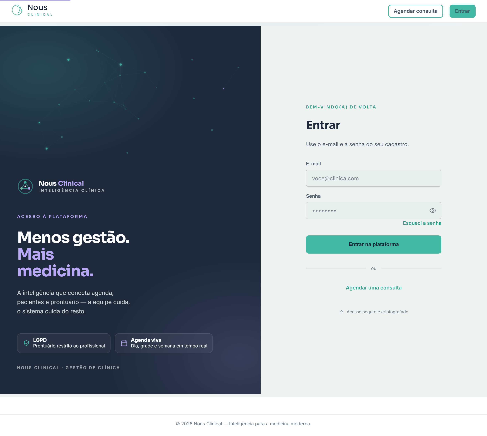

# Bem-vindo ao Nous Clinical

> **Para que serve:** este manual ensina, passo a passo, a usar o Nous Clinical no
> dia a dia da clínica. **Quem usa:** toda a equipe — recepção, profissionais de
> saúde e o gestor. Leia o capítulo do seu papel; o resto fica de consulta.

O **Nous Clinical** é o sistema que organiza a sua clínica: agenda, pacientes,
prontuário, financeiro e relatórios — tudo em um lugar. O lema diz a ideia toda:

> **Menos gestão. Mais medicina.**

Você não precisa entender de tecnologia. Se sabe usar WhatsApp e e-mail, sabe usar
o Nous. Quando tiver dúvida de "como faço tal coisa", procure o capítulo do módulo
neste manual — ou pergunte ao **assistente de ajuda** dentro do próprio sistema
(veja o capítulo *Assistente de Ajuda*).

---

## Os quatro papéis (quem vê o quê)

Cada pessoa entra com o seu próprio login, e o sistema **mostra só o que aquele
papel pode usar**. Isso protege os dados (principalmente o prontuário) e deixa a
tela de cada um mais simples.

| Papel | Quem é | O que faz no sistema |
|---|---|---|
| **Administrador** | Dono(a) ou gestor(a) da clínica | Vê **tudo** da clínica: agenda, pacientes, financeiro, **relatórios**, **auditoria**, cadastro de profissionais e a **personalização da marca**. |
| **Recepção** | Recepcionista / secretária | Agenda consultas, cadastra pacientes, cuida do financeiro do dia a dia e dos cadastros. **Não** vê prontuário nem relatórios. |
| **Profissional** | Médico(a) e demais profissionais de saúde | Vê a **própria agenda**, registra o **atendimento (prontuário)** e acessa os pacientes que atende. |
| **Recepção × despesas** | — | Detalhe importante: a recepção **não** vê nem lança despesas de aluguel, salário e imposto. Isso é só do administrador. |

> 🔒 **Quem acessa:** ao longo do manual, as caixas com o cadeado avisam qual papel
> pode ver ou fazer cada coisa.

---

## Como entrar (login)

1. Abra o endereço do sistema no navegador (seu administrador informa o link).
2. Digite o seu **e-mail** e a sua **senha**.
3. Clique em **Entrar na plataforma**.

> 💡 **Dica:** esqueceu a senha? Clique em **Esqueci a senha** na própria tela de
> login — você recebe um link para criar uma nova. (Mais detalhes no capítulo
> *Meu Perfil e Senha*.)

> ⚠️ **Atenção:** sua senha é pessoal. Não compartilhe o login — cada ação no
> sistema fica registrada no nome de quem está logado (veja *Relatórios e Auditoria*).

---

## O caminho de uma consulta (o fluxo principal)

Para você ter a visão do todo, é assim que uma consulta "anda" dentro do Nous —
cada etapa tem um capítulo próprio neste manual:

1. **O administrador cadastra os profissionais** (e o login de cada um). → *Profissionais*
2. **A recepção cadastra o paciente.** → *Pacientes*
3. **A recepção agenda a consulta.** → *Agenda*
4. **No dia, a recepção faz o check-in** (marca que o paciente chegou). → *Agenda*
5. **O profissional registra o atendimento** (prontuário). A consulta vira
   "atendido" sozinha. → *Atendimento*
6. **A recepção recebe o pagamento** da consulta. → *Financeiro*

E há os módulos que apoiam tudo isso: **CRM** (trazer o paciente de volta),
**Relatórios**, **Cadastro de Itens**, **Personalização da marca**, **WhatsApp** e
o **Agendamento online** (o paciente marcando sozinho pelo link da clínica).

---

## Como ler este manual

- Cada capítulo começa dizendo **para que serve** e **quem usa**.
- Os passos são **numerados** — siga na ordem.
- Os nomes de **botões** e **campos** estão em **negrito**, igualzinho à tela.
- Fique de olho nas caixas:
  - 💡 **Dica** — um atalho ou boa prática.
  - ⚠️ **Atenção** — um erro comum, um dado sensível ou algo que não dá para desfazer.
  - 🔒 **Quem acessa** — qual papel pode ver/fazer aquilo.

Boa leitura — e bem-vindo(a) ao Nous. 🩺
