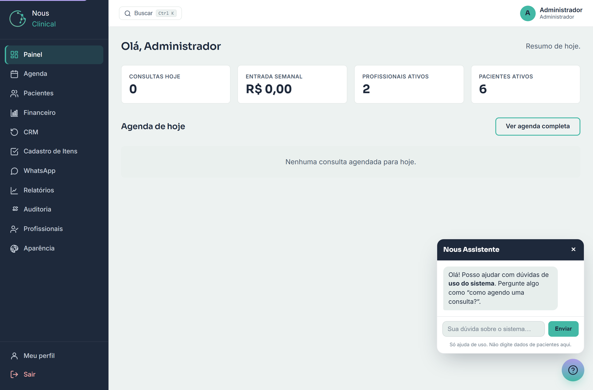
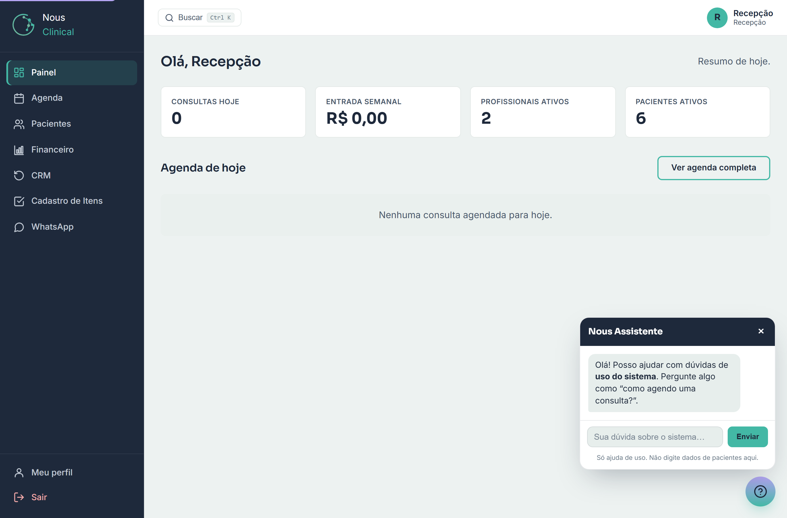

# Painel

O **Painel** é a primeira tela que você vê depois de entrar no sistema. Ele dá um resumo do dia e atalhos para o trabalho. Todos os papéis usam (administrador, recepção e profissional), mas o que aparece muda conforme quem está logado.

## O que tem na tela

No topo aparece uma saudação com o seu nome ("Olá, ...") e a frase **Resumo de hoje.**. Logo abaixo ficam os números do dia (os "cartões") e a **Agenda de hoje**.

Os cartões que podem aparecer são:

1. **Consultas hoje** — quantas consultas estão marcadas para o dia de hoje.
2. **Faturamento hoje** — quanto a clínica **já recebeu hoje** (só o que foi pago/recebido no dia). Clicar leva ao **Financeiro** do dia.
3. **Entrada semanal** — quanto a clínica já recebeu nesta semana (de segunda a domingo). Clicar neste cartão leva ao **Financeiro** da semana.
4. **Faltas hoje** — quantos pacientes **faltaram** hoje, com a **porcentagem** entre parênteses (faltas sobre as consultas do dia que não foram canceladas). Ajuda a sentir, na hora, se o dia está com muita ausência.
5. **A receber em atraso** — o total de **contas a receber que já venceram** e ainda não foram pagas, com a quantidade de contas entre parênteses. Quando há valor em atraso, o cartão aparece em **destaque vermelho**; clicar leva a **Contas a receber / pagar**.
6. **Profissionais ativos** — quantos profissionais estão cadastrados e ativos. Para o administrador, clicar abre a lista de **Profissionais**.
7. **Pacientes ativos** — quantos pacientes estão cadastrados e ativos. Clicar abre a lista de **Pacientes**.

> 💡 **Dica:** os cartões que têm um link mudam o ponteiro do mouse para uma mãozinha. Se passar o mouse e ele virar mãozinha, é porque dá para clicar e ir direto àquela tela.

## Ocupação por profissional (hoje)

Mais abaixo, gestores e recepção veem a tabela **Ocupação por profissional (hoje)** — uma linha por profissional que tem consulta no dia, com três números:

- **Consultas** — quantas consultas o profissional tem hoje (sem contar as canceladas).
- **Atendidas** — quantas dessas já viraram atendimento (prontuário registrado).
- **Faltas** — quantos pacientes faltaram com aquele profissional.

É a visão rápida de como está rendendo o dia de cada profissional: quem já "rodou" a agenda, quem ainda tem fila e onde estão concentrando as faltas.

> 🔒 **Quem acessa:** essa tabela aparece **só para o administrador e a recepção**. O profissional não a vê.

## A agenda de hoje

Abaixo dos cartões fica o bloco **Agenda de hoje**, com as consultas do dia em uma lista: **Horário**, **Paciente**, **Profissional** e **Status** (agendado, confirmado, atendido, etc.).

1. Para abrir a agenda completa, clique em **Ver agenda completa** (canto direito do bloco).
2. Se não houver consultas, aparece a mensagem **Nenhuma consulta agendada para hoje.** — é normal, só significa que o dia ainda está vazio.

## Como o Painel muda conforme quem entra

A mesma tela mostra coisas diferentes para cada papel. Isso protege informação: quem não precisa ver o dinheiro da clínica, não vê.

**Administrador e Recepção** veem todos os cartões de gestão: **Consultas hoje**, **Faturamento hoje**, **Entrada semanal**, **Faltas hoje**, **A receber em atraso**, **Profissionais ativos** e **Pacientes ativos** — além da tabela **Ocupação por profissional**. A agenda de hoje traz as consultas de **todos** os profissionais.

> 🔒 **Quem acessa:** os cartões com **dinheiro** (**Faturamento hoje**, **Entrada semanal**, **A receber em atraso**), o cartão **Faltas hoje** e a tabela de **Ocupação** são números de gestão e aparecem **só para o administrador e a recepção**. O **profissional** não vê nenhum deles.

**Profissional** vê uma tela mais enxuta: apenas o cartão **Consultas hoje** e a **Agenda de hoje** com **as suas próprias consultas** — não as dos colegas. Não aparecem os números de dinheiro (faturamento, entrada, a receber), nem as faltas, nem a ocupação, nem os totais de pacientes e profissionais da clínica.

> ⚠️ **Atenção:** se você é profissional e o cartão **Consultas hoje** está em **0**, confira se a recepção já marcou seus pacientes do dia. O número conta só as consultas marcadas **com você**.

## Busca rápida (campo Buscar)

No alto da tela, ao lado do nome da clínica, existe o campo **Buscar**. Use-o para achar um paciente sem precisar abrir a lista inteira.

1. Clique em **Buscar** (ou aperte as teclas **Ctrl** e **K** ao mesmo tempo, em qualquer tela).
2. Digite pelo menos **duas letras** do nome do paciente.
3. Os resultados aparecem na hora; clique no nome para abrir a ficha do paciente.

> 💡 **Dica:** o atalho **Ctrl K** funciona de qualquer lugar do sistema. Decore esse atalho — é o jeito mais rápido de pular para a ficha de um paciente.

> 🔒 **Quem acessa:** a recepção e o administrador encontram **qualquer** paciente da clínica. O **profissional** só encontra os pacientes que ele atende (que têm consulta marcada com ele).

## Perguntas rápidas

**Por que meu Painel é diferente do da recepção?**
Porque o sistema mostra cada coisa para quem precisa. O profissional vê só as próprias consultas; recepção e administrador veem os números da clínica inteira, inclusive o financeiro.

**O cartão de dinheiro sumiu. É erro?**
Não. Os cartões de dinheiro (**Faturamento hoje**, **Entrada semanal**, **A receber em atraso**), as **Faltas hoje** e a tabela de **Ocupação** só aparecem para administrador e recepção. Se você é profissional, eles não são exibidos de propósito.

**O cartão "A receber em atraso" está vermelho. O que faço?**
Significa que há contas a receber que **já passaram do vencimento**. Clique no cartão para abrir **Contas a receber / pagar** e ver quais são — assim dá para cobrar ou dar baixa. Se não há nada vencido, o cartão nem aparece.

**Como volto para o Painel depois de navegar?**
Clique em **Painel** no menu lateral, a qualquer momento.

**A busca não acha o paciente. O que houve?**
Digite ao menos duas letras e confira a grafia do nome. Se você é profissional, lembre que a busca só mostra os pacientes que você atende.
