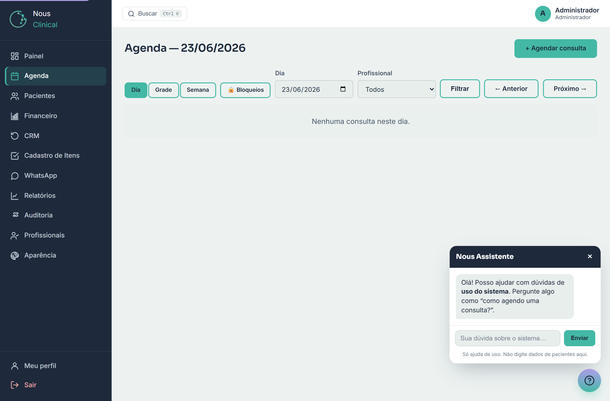
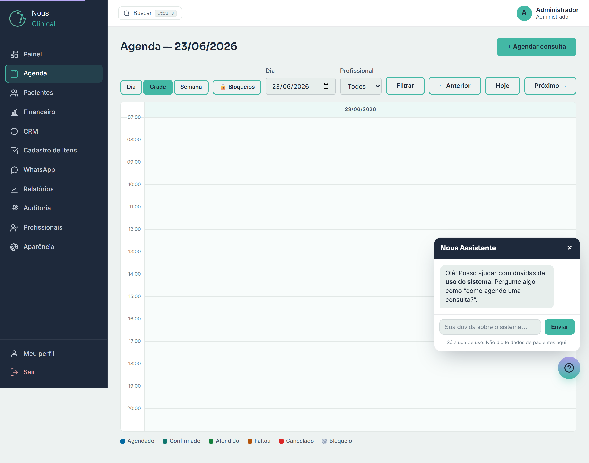
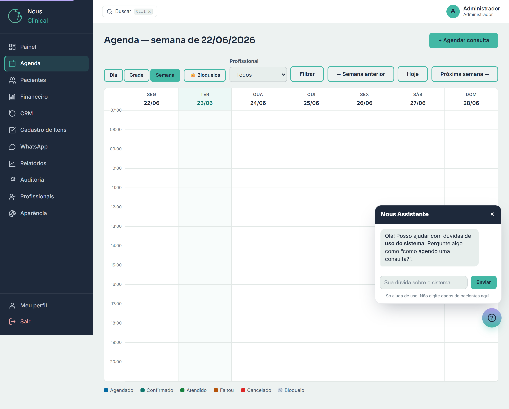
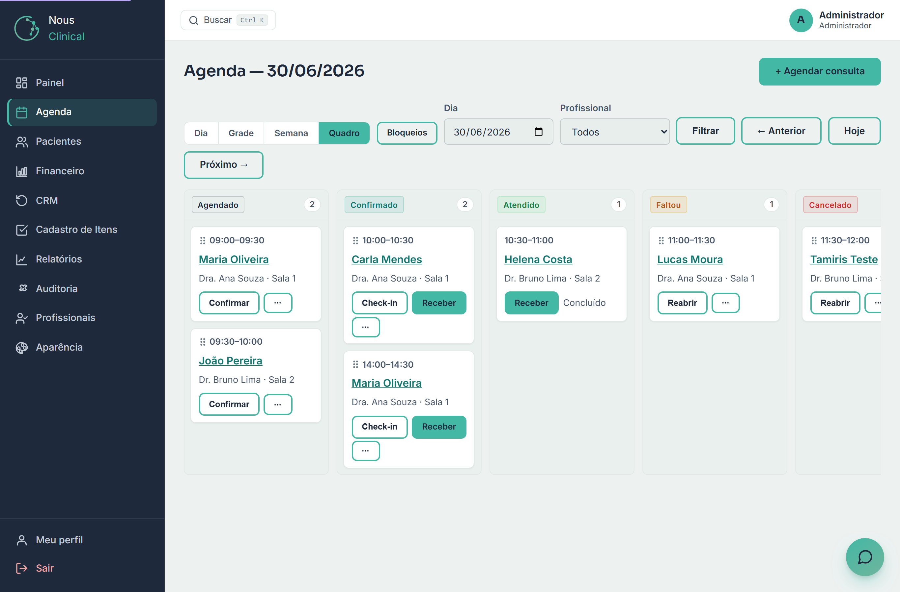
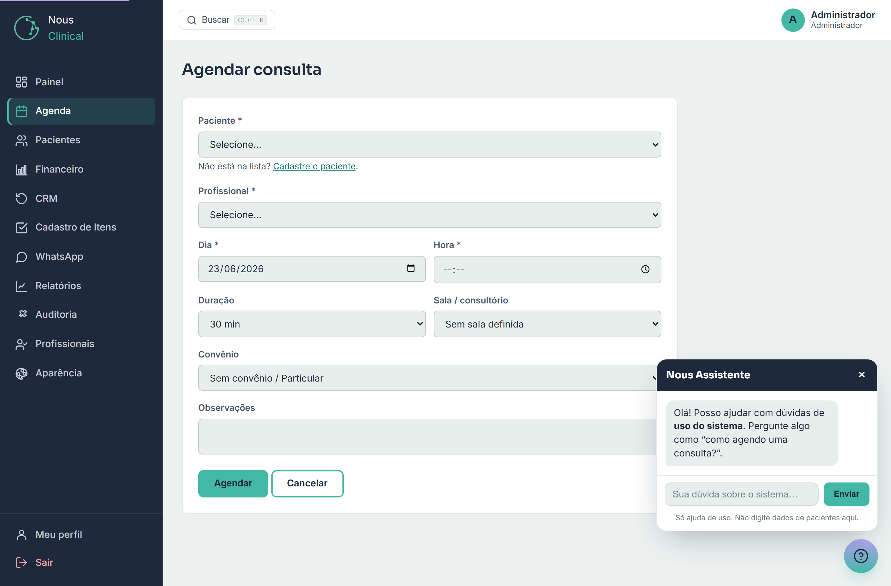
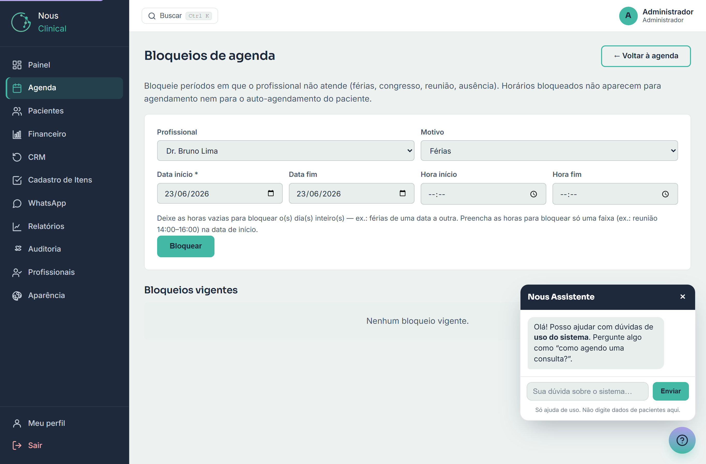

# Agenda

A **Agenda** é o coração do dia a dia da clínica: é onde você marca as consultas,
acompanha quem chegou, registra confirmações e faltas, reagenda e bloqueia horários
em que o profissional não atende.

> 🔒 **Quem acessa:** a **Recepção** e o **Administrador** marcam, reagendam e mudam o
> status das consultas de todos os profissionais. O **Profissional** (quem atende — médico,
> dentista, psicólogo, fisio…) vê
> **apenas a própria agenda** e abre cada consulta para atender — ele não marca consultas
> nem mexe na agenda dos colegas.

Para abrir, clique em **Agenda** no menu lateral.

---

## As 4 formas de ver a agenda

No topo da tela há quatro botões que mudam só o **jeito de visualizar** as mesmas
consultas: **Dia**, **Grade**, **Semana** e **Quadro**. O botão da visão atual fica
destacado.

### Visão Dia (lista)

É a visão padrão. Mostra as consultas do dia em **lista**, uma por linha, com horário,
paciente, profissional, status e as ações. É a melhor visão para o trabalho da recepção
(receber, confirmar, dar check-in).

Para navegar entre os dias use os botões **← Anterior** e **Próximo →**, ou escolha
uma data no campo **Dia** e clique em **Filtrar**.

> 💡 **Dica:** o campo **Profissional** (com a opção **Todos**) filtra a lista por um
> profissional específico. Esse filtro aparece para a recepção e o administrador; o
> profissional já vê só a si mesmo, então não precisa dele.

### Visão Grade (dia em colunas de horário)

A **Grade** mostra o **mesmo dia**, mas como um quadro de horários (das 07:00 às 21:00),
com cada consulta posicionada na sua faixa, parecido com uma agenda de calendário. É boa
para enxergar de relance os "buracos" livres do dia.

### Visão Semana

A **Semana** mostra os 7 dias (segunda a domingo) lado a lado, cada consulta no seu
horário. Ótima para ter a visão geral da semana.

Aqui a navegação é por semana: **← Semana anterior**, **Hoje** e **Próxima semana →**.
Embaixo da grade há uma **legenda de cores** por status (Agendado, Confirmado, Atendido,
Faltou, Cancelado) e a marcação de **Bloqueio**.

> 💡 **Dica:** trocar de visão não perde o dia. Se você está vendo 23/06 na lista e clica
> em **Semana**, abre a semana que contém 23/06.

### Visão Quadro (Kanban, consultas por status)

O **Quadro** mostra as consultas do dia em **colunas por status**: **Agendado**,
**Confirmado**, **Atendido**, **Faltou** e **Cancelado**. Cada consulta vira um
**card** com horário, paciente, profissional e sala — e ela aparece na coluna do status
em que está. É a melhor visão para enxergar de relance "onde está cada paciente" no
fluxo do dia: quem ainda não confirmou, quem já foi atendido, quem faltou.

**Para mudar o status de uma consulta, você tem dois caminhos:**

- **Arrastar o card** de uma coluna para outra. Segure o card pela **alça ⠿** (no canto
  do card) e solte na coluna do novo status — por exemplo, arraste de **Agendado** para
  **Confirmado** quando o paciente confirma. É o jeito mais rápido.
- **Usar os botões** do próprio card (ex.: **Confirmar**, **Check-in**, **Reabrir**).

As **ações secundárias** ficam organizadas num menu **⋯ Mais** dentro do card — clique
nele para ver opções como **Faltou**, **Cancelar consulta**, **Check-in**, **Editar** e
**Lembrete (WhatsApp)**. Assim o card fica limpo, com só as ações principais à mostra.

> ⚠️ **Atenção:** o card de uma consulta **Atendida** **não se arrasta** e não muda de
> coluna. Como em todas as visões, o status **Atendido** só surge quando o profissional
> registra o prontuário — e, depois disso, a consulta fica "trancada".

> 🔒 **Quem acessa:** só a **Recepção** e o **Administrador** arrastam cards e mudam
> status no Quadro. O **profissional** vê o quadro da própria agenda, mas no
> lugar das ações de status tem o botão **Atender** para abrir o prontuário.

---

## Marcar uma consulta nova

1. Na Agenda, clique em **+ Agendar consulta** (canto superior direito).
2. Preencha o formulário **Agendar consulta**.

Os campos:

- **Paciente \*** — escolha na lista. Não está na lista? Use o link **Cadastre o
  paciente** logo abaixo do campo para cadastrá-lo antes.
- **Profissional \*** — quem vai atender.
- **Dia \*** e **Hora \*** — a data e o horário de início.
- **Duração** — quanto tempo a consulta ocupa: **30**, **60**, **90** ou **120 min**.
  Ao escolher o profissional, o sistema já sugere a duração padrão dele; você pode trocar.
- **Sala / consultório** — onde será o atendimento. Se você deixar **Sem sala definida**,
  o sistema usa a sala padrão do profissional (quando ele tem uma).
- **Convênio** — escolha um da lista de convênios da clínica, ou deixe
  **Sem convênio / Particular**.
- **Observações** — um lembrete livre (ex.: "paciente vai trazer exames").

3. Clique em **Agendar**. A consulta nasce com o status **Agendado** e você volta para
   a lista do dia.

> 💡 **Dica:** os campos com **\*** (Paciente, Profissional, Dia, Hora) são obrigatórios.

---

## O que o sistema bloqueia ao marcar

Para evitar erros comuns, o sistema **não deixa salvar** nestes casos — ele mostra um
aviso em vermelho explicando o motivo, e você corrige e tenta de novo:

- **Conflito de horário do profissional** — o mesmo profissional já tem outra consulta que
  encosta nesse horário. O aviso diz das que horas até que horas ele já está ocupado.
- **Sala ocupada** — já existe consulta na **mesma sala** naquele horário. Escolha outra
  sala ou outro horário.
- **Agenda bloqueada** — você tentou marcar dentro de um período de **bloqueio** (férias,
  reunião etc.) daquele profissional. O aviso mostra o motivo e o período.
- **Data no passado** — não dá para marcar uma consulta para um dia que já passou.

> ⚠️ **Atenção:** essas travas valem o porquê de existirem — evitam marcar dois pacientes
> na mesma sala ou no mesmo horário do profissional. Se aparecer o aviso, é o sistema te
> protegendo de um conflito real, não um erro do programa.

---

## Acompanhar o dia: status e check-in

Na visão **Dia**, cada consulta tem uma coluna de **Status** e ações ao lado.

### Mudar o status

O status conta em que pé está a consulta. Você o controla pela recepção:

- **Agendado** → **Confirmado** → **Atendido**
- ou **Cancelado** / **Faltou**

Para mudar, escolha o novo status no seletor da linha e clique em **Salvar**. Algumas
ações menos usadas do dia a dia (como **Faltou**, **Cancelar**, **Check-in**, **Editar**
e **Lembrete**) ficam reunidas num menu **⋯ Mais** na própria linha — clique nos três
pontinhos para abrir e escolher. É o mesmo menu que aparece nos cards da visão **Quadro**.

> ⚠️ **Atenção:** você define manualmente **Agendado**, **Confirmado**, **Cancelado** e
> **Faltou**. O status **Atendido** **não** é marcado à mão — ele aparece sozinho quando
> o **profissional registra o atendimento** (o prontuário) daquela consulta. Por isso,
> uma consulta já **Atendida** não pode mais ter o status alterado nem ser reagendada.

### Check-in (chegada do paciente)

Quando o paciente chega na recepção, clique em **Check-in** na linha da consulta. Isso
marca a hora da chegada (aparece um selo **Chegou HH:MM**) e, se a consulta estava só
**Agendado**, ela passa automaticamente para **Confirmado** — afinal, o paciente está
ali. Para desfazer, clique em **Desfazer check-in**.

> 💡 **Dica:** o check-in serve como a "fila do dia": dá para ver rapidamente quem já
> chegou e está aguardando atendimento.

---

## Reagendar (mudar uma consulta marcada)

1. Na linha da consulta, clique em **Editar**.
2. Na tela **Reagendar consulta**, ajuste **Profissional**, **Dia**, **Hora**,
   **Duração**, **Sala / consultório**, **Convênio** ou **Observações**.
3. Clique em **Salvar reagendamento**.

As mesmas travas da hora de marcar valem aqui (conflito de horário, sala ocupada,
bloqueio, data no passado).

> ⚠️ **Atenção:** consulta já **Atendida** não pode ser reagendada. Reagende antes do
> atendimento ser registrado.

---

## Bloqueios de agenda (férias, congresso, reunião)

Quando o profissional **não vai atender** num período, registre um **bloqueio**. Os
horários bloqueados deixam de aparecer para agendamento (inclusive no auto-agendamento
online do paciente).

Para abrir, clique em **Bloqueios** na barra da Agenda.

Para criar um bloqueio:

1. Escolha o **Profissional** (a recepção e o administrador escolhem qualquer um; o
   próprio profissional só bloqueia a sua agenda).
2. Escolha o **Motivo** (férias, congresso, reunião, ausência).
3. Informe a **Data início \*** e, se for mais de um dia, a **Data fim**.
4. Decida o tipo de bloqueio:
   - **Dia(s) inteiro(s):** deixe **Hora início** e **Hora fim** em branco. Bloqueia da
     data de início até a data fim — ideal para férias.
   - **Faixa de horário:** preencha **Hora início** e **Hora fim** (ex.: reunião de
     14:00 às 16:00). Vale na data de início.
5. Clique em **Bloquear**.

Os bloqueios ativos aparecem na lista **Bloqueios vigentes**. Para apagar um, clique em
**Remover** na linha dele.

> 🔒 **Quem acessa:** recepção, administrador e profissional podem criar bloqueios. O
> **profissional** só pode bloquear (e remover) a **própria** agenda.

---

## Perguntas rápidas

**Por que não consigo marcar nesse horário?**
Provavelmente há um conflito: o profissional já tem consulta nesse horário, a sala está
ocupada, ou existe um bloqueio (férias/reunião) no período. O aviso em vermelho diz qual
é o caso. Escolha outro horário, outra sala ou outro profissional.

**Como marco que o paciente chegou?**
Clique em **Check-in** na linha da consulta. Se ela estava como **Agendado**, vira
**Confirmado** sozinha.

**Marquei "Atendido" por engano e agora não muda mais. E agora?**
O status **Atendido** só surge quando o **profissional registra o prontuário** — não é
algo que se marque à mão. Uma vez atendida, a consulta fica "trancada" na agenda. Se
houve engano no atendimento, fale com o profissional ou o administrador.

**O profissional vê a agenda dos outros?**
Não. Cada profissional vê **somente a própria agenda**. Quem enxerga e organiza a agenda
de todos é a **recepção** e o **administrador**.
