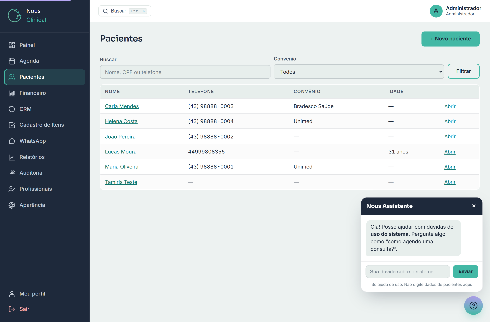
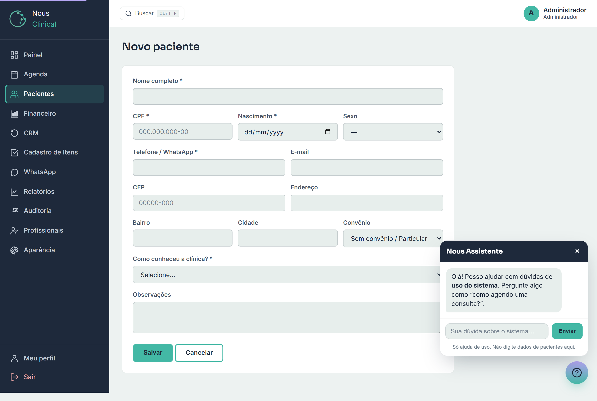
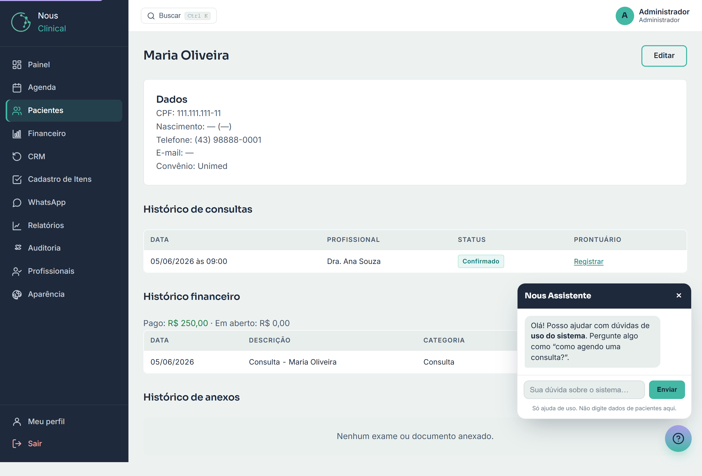

# Pacientes

A tela **Pacientes** é a sua agenda de cadastros: é onde ficam guardados todos os
pacientes da clínica, com telefone, convênio e o histórico de cada um. Você usa
ela para encontrar alguém rápido, cadastrar um paciente novo e abrir a ficha
completa de cada pessoa.

> 🔒 **Quem acessa:** a **Recepção** e o **Administrador** cadastram e editam
> pacientes. O **Profissional** (quem atende — médico, dentista, psicólogo, fisio…)
> **não cadastra** — ele só enxerga os
> pacientes que ele mesmo atende (ou seja, com quem tem consulta marcada).

---

## Encontrar um paciente na lista

Ao clicar em **Pacientes** no menu, você vê a lista de todos os pacientes da
clínica, em ordem alfabética.

Cada linha mostra o **Nome**, o **Telefone**, o **Convênio** e a **Idade**. Um
traço (—) significa que aquele dado não foi preenchido.

Para buscar:

1. No campo **Buscar**, digite o que você sabe: **nome**, **CPF** ou **telefone**.
2. Clique em **Filtrar** (ou aperte Enter).
3. A lista mostra só quem combina com a busca.

Para ver só os pacientes de um convênio:

1. No campo **Convênio**, escolha o convênio desejado (ou deixe em **Todos**).
2. Clique em **Filtrar**.

> 💡 **Dica:** você pode combinar os dois. Por exemplo, digite parte do nome
> **e** escolha um convênio ao mesmo tempo para refinar a busca.

Para entrar na ficha de alguém, clique no **nome** do paciente ou no botão
**Abrir** na ponta da linha.

---

## Cadastrar um paciente novo

1. Na tela **Pacientes**, clique em **+ Novo paciente** (canto superior direito).
2. Preencha o formulário (veja abaixo o que é obrigatório e o que é opcional).
3. Clique em **Salvar**.

Se quiser desistir, clique em **Cancelar** e nada é gravado.

### Campos obrigatórios (marcados com *)

Sem estes, o sistema **não deixa salvar**:

- **Nome completo** — o nome do paciente.
- **CPF** — digite no formato **000.000.000-00**. O sistema **confere se o CPF é
  válido**: se você errar um número, aparece o aviso "CPF inválido" e o cadastro
  não é salvo. Também não dá para ter dois pacientes com o mesmo CPF.
- **Nascimento** — a data de nascimento. A idade é calculada sozinha a partir
  dela.
- **Telefone / WhatsApp** — o telefone de contato.
- **Como conheceu a clínica?** — escolha uma opção da lista (Google, Instagram,
  Facebook, Indicação, Site, Convênio, Outdoor, Rádio ou Outros). Isso ajuda a
  clínica a entender de onde vêm os pacientes.

> ⚠️ **Atenção:** se faltar qualquer campo obrigatório, o sistema mostra um aviso
> em vermelho no topo dizendo o que precisa ser corrigido, e o que você já tinha
> digitado continua lá. É só ajustar e clicar em **Salvar** de novo.

### Campos opcionais

Você pode deixar em branco, mas preencher ajuda no dia a dia:

- **Sexo** — Feminino, Masculino ou Outro.
- **E-mail** — para enviar documentos e comunicados.
- **CEP** — digite e o sistema **preenche o endereço sozinho** (Endereço, Bairro
  e Cidade) buscando pelo CEP. Confira e ajuste se precisar.
- **Endereço**, **Bairro**, **Cidade** — completam o endereço.
- **Convênio** — escolha o plano do paciente na lista. Se ele paga do próprio
  bolso, escolha **Sem convênio / Particular**.
- **Observações** — qualquer anotação útil sobre o paciente (preferências,
  alergias gerais, etc.).

> 💡 **Dica:** preencha o CEP primeiro e deixe o endereço se completar sozinho —
> é mais rápido e evita erro de digitação.

Depois de salvar, você cai direto na **ficha do paciente** já cadastrado.

---

## Abrir a ficha do paciente

Ao clicar no nome de um paciente, você abre a ficha completa dele.

A ficha tem:

- **Dados** — CPF, nascimento (com a idade), telefone, e-mail, convênio e as
  observações. Para corrigir algo, clique em **Editar** no canto superior direito.
- **Histórico de consultas** — todas as consultas do paciente, com data,
  profissional e o status de cada uma (Confirmado, Atendido, Faltou, etc.).
- **Histórico financeiro** — os lançamentos ligados ao paciente, com o total já
  **Pago** e o total **Em aberto**.
- **Histórico de anexos** — exames e documentos anexados ao prontuário.

> 🔒 **Só o profissional vê o prontuário:** as colunas e o histórico ligados ao
> **prontuário** (a coluna **Prontuário** no histórico de consultas e o
> **Histórico de anexos**) aparecem **somente para o Profissional e para o
> Administrador**. A **Recepção** vê o cadastro, as consultas e o financeiro,
> mas **não** vê o prontuário nem os exames — são dados sensíveis de saúde,
> protegidos pela LGPD.

> ⚠️ **Atenção (profissional):** você só consegue abrir a ficha de pacientes que você
> atende. Se tentar abrir alguém que não é seu paciente, o sistema avisa e te leva
> de volta para a lista.

---

## Anonimizar um paciente (LGPD — direito ao esquecimento)

A LGPD dá ao paciente o direito de pedir que seus dados sejam **apagados**. Para atender isso, o sistema tem a **anonimização** — disponível **só para o administrador**, na própria ficha do paciente.

**O que a anonimização faz:**
- **Apaga os dados pessoais** (nome, CPF, telefone, e-mail, endereço, observações);
- **Apaga o prontuário e os exames** anexados;
- **Preserva o histórico financeiro** (valores, datas, forma de pagamento) **sem o nome** — porque a **lei fiscal exige** guardar esses lançamentos.

**Como fazer (admin):**
1. Abra a ficha do paciente.
2. Vá até o quadro **LGPD — direito ao esquecimento** (no fim da página).
3. Clique em **Anonimizar este paciente**, leia o aviso, digite a palavra **ANONIMIZAR** para confirmar e conclua.

> ⚠️ **É irreversível.** Depois de anonimizado, os dados pessoais e clínicos **não voltam**. A ação fica **registrada na Auditoria** (quem fez e quando), sem expor os dados apagados. Use somente diante de um pedido legítimo de exclusão.

## Perguntas rápidas

**Sou profissional e não vejo o botão "+ Novo paciente". Por quê?**
Porque o cadastro de pacientes é feito pela **Recepção** ou pelo
**Administrador**. Peça para a recepção cadastrar — depois o paciente aparece para
você quando tiver consulta marcada na sua agenda.

**Digitei o CPF e deu "CPF inválido". O que faço?**
Confira os números: o sistema valida o CPF de verdade, então um dígito trocado
faz ele recusar. Digite só os números corretos (a pontuação o sistema completa).

**O CPF é obrigatório mesmo?**
Sim. Nome, CPF, Nascimento, Telefone e "Como conheceu a clínica?" são
obrigatórios para salvar um paciente novo.

**Cadastrei errado, como corrijo?**
Abra a ficha do paciente e clique em **Editar**. Ajuste o que precisar e clique
em **Salvar**.

**Não acho o paciente na lista.**
Tente buscar por outro dado (CPF ou telefone em vez do nome) e verifique se o
filtro de **Convênio** não está limitando a lista — deixe em **Todos**.
