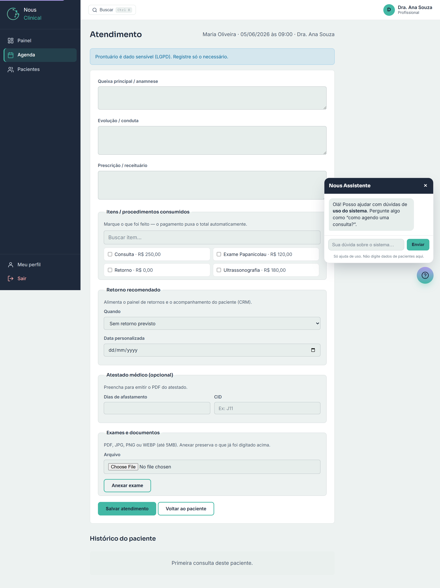

# Atendimento (Prontuário)

O **Atendimento** é onde você, **profissional**, registra a consulta: queixa, evolução,
prescrição, exames e o que mais precisar. É o prontuário do paciente.

> 🔒 **Quem acessa:** só o **profissional** e o **administrador**. A **recepção não
> entra aqui** — prontuário é dado sensível (LGPD). E você vê apenas os atendimentos
> **dos seus próprios pacientes**: no histórico aparecem só as consultas que passaram
> por você.

## Como abrir o atendimento

1. Na barra lateral, clique em **Agenda**.
2. Encontre a consulta do paciente no dia.
3. Clique em **Registrar** (na coluna **Prontuário**). Abre a tela de atendimento.

> 💡 **Dica:** você também chega aqui pela ficha do paciente. Em **Pacientes**, abra o
> paciente e, no **Histórico de consultas**, clique em **Registrar** na linha da consulta.

No topo da tela aparece o nome do paciente, a data/hora e o seu nome, e o aviso:
**"Prontuário é dado sensível (LGPD). Registre só o necessário."**

## Preencher o prontuário

Preencha os campos conforme a consulta. Nenhum é obrigatório — escreva só o que fizer sentido.

1. **Queixa principal / anamnese** — o que o paciente relata, o motivo da consulta.
2. **Evolução / conduta** — sua avaliação, exame físico e a conduta adotada.
3. **Prescrição / receituário** — os medicamentos e orientações. É o que vira a **Receita** em PDF (veja abaixo).

## Marcar itens / procedimentos realizados

Logo abaixo da prescrição está o bloco **Itens / procedimentos consumidos**.

1. **Marque** a caixinha de cada item que foi feito na consulta (consulta, retorno, exame, etc.). Cada um mostra o valor ao lado.
2. Se a lista for grande, use o campo **Buscar item…** para filtrar pelo nome.

> 💡 **Dica:** o que você marcar aqui **alimenta o financeiro automaticamente** — quando
> a recepção for receber a consulta, o total já vem somado. Por isso vale marcar tudo
> que foi realizado.

## Definir o retorno recomendado

No bloco **Retorno recomendado** você indica quando o paciente deve voltar. Isso
**alimenta o painel de retornos e o acompanhamento do paciente (CRM)** — ajuda a clínica
a lembrar o paciente de remarcar.

1. No campo **Quando**, escolha uma opção: **Sem retorno previsto**, **Em 30 dias**,
   **Em 90 dias**, **Em 180 dias** ou **Em 1 ano**.
2. Para uma data específica, escolha **Data personalizada…** e preencha o campo
   **Data personalizada** com o dia desejado.

## Emitir atestado (dias + CID)

O bloco **Atestado (opcional)** serve para gerar o PDF do atestado.

1. Em **Dias de afastamento**, informe quantos dias o paciente fica afastado.
2. Em **CID**, informe o código (ex.: **J11**), se for o caso.
3. **Salve o atendimento** (veja abaixo) para liberar o PDF.

> 💡 **Dica:** o atestado só fica disponível depois que você preenche os **dias de
> afastamento** e salva. O CID é opcional.

## Anexar exames e documentos

No bloco **Exames e documentos** você guarda arquivos junto da consulta (PDF, JPG, PNG
ou WEBP, até 5 MB).

1. Em **Arquivo**, clique em **Choose File** e selecione o arquivo.
2. Clique em **Anexar exame**.

> 💡 **Dica:** **anexar um exame NÃO encerra o atendimento.** O sistema salva o rascunho
> que você já digitou (queixa, evolução, prescrição, itens, atestado) e mantém a consulta
> aberta — você pode continuar escrevendo. A consulta só vira "atendido" quando você
> clica em **Salvar atendimento**.

Os arquivos anexados aparecem numa lista logo abaixo, com a data e a opção **Remover**.

## Salvar o atendimento

1. Confira o que preencheu.
2. Clique em **Salvar atendimento**.

Ao salvar, a consulta passa **automaticamente para o status "atendido"** na agenda — você
não precisa mudar o status à mão.

> ⚠️ **Atenção:** depois que a consulta vira **atendido**, ela **não pode mais mudar de
> status nem ser reagendada** na agenda. Salve quando o atendimento estiver concluído.

Para sair sem concluir, use **Voltar ao paciente** — ele leva à ficha do paciente.

## Gerar os PDFs (Receita e Atestado)

Depois de salvar (com prescrição e/ou atestado preenchidos), aparece uma barra de
**Documentos** com os botões:

- **Exportar prescrição (PDF)** — gera a **Receita**. Aparece quando há prescrição escrita.
- **Exportar atestado (PDF)** — gera o **Atestado**. Aparece quando há dias de afastamento informados.

Os PDFs abrem em uma nova aba, com a logo da clínica, prontos para imprimir.

> 💡 **Dica:** se um botão não aparecer, é porque o campo correspondente ainda está vazio
> — escreva a prescrição (ou os dias do atestado), salve, e o botão surge.

## Histórico do paciente

No fim da tela está o **Histórico do paciente**: as consultas anteriores. Clique em uma
para expandir e ver queixa, evolução, prescrição e o retorno recomendado daquela vez.

> 🔒 **Quem acessa:** o histórico mostra só os atendimentos ligados a você. Outro
> profissional não vê os seus, e você não vê os dele — cada um enxerga os próprios.

## Perguntas rápidas

**Anexei um exame e sumiu o que eu tinha escrito?**
Não some. Anexar exame salva o rascunho automaticamente e mantém a consulta aberta. O que
você digitou continua lá.

**Preciso mudar o status para "atendido" na agenda?**
Não. Ao clicar em **Salvar atendimento**, a consulta vira "atendido" sozinha.

**Não aparece o botão para exportar a receita.**
O botão **Exportar prescrição (PDF)** só aparece quando há texto no campo **Prescrição /
receituário** e o atendimento foi salvo. O mesmo vale para o atestado (precisa dos **dias
de afastamento**).

**A recepção consegue ver o que escrevi no prontuário?**
Não. O prontuário é dado sensível (LGPD) e fica restrito a você e ao administrador.
