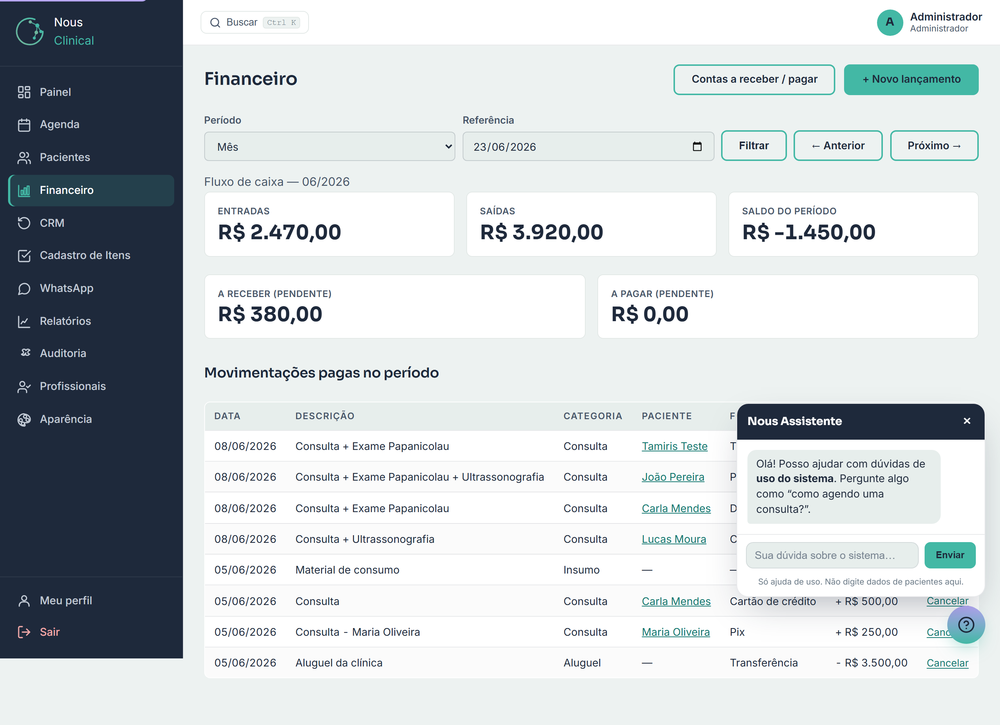
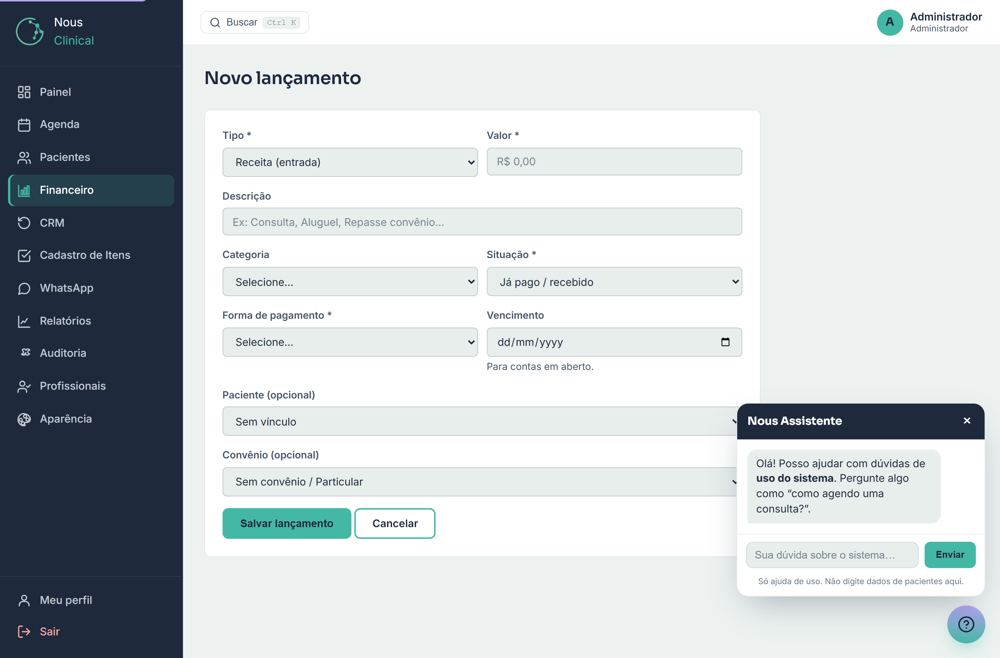
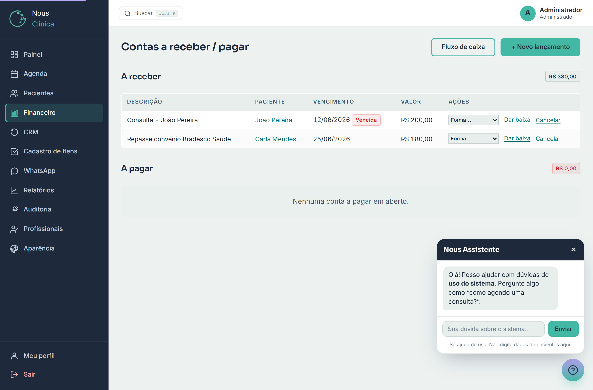
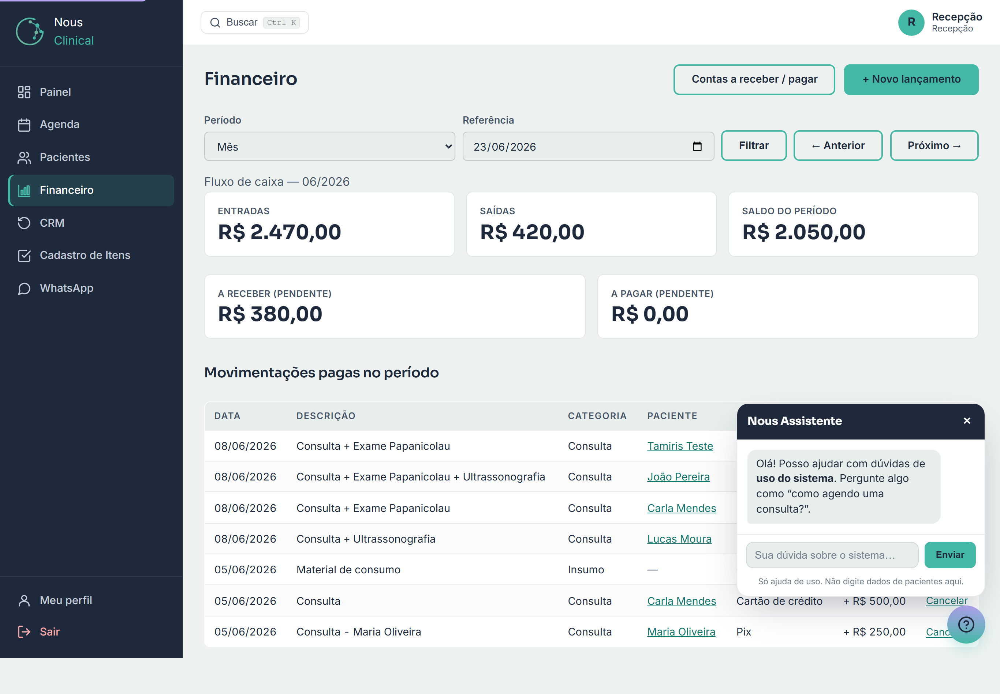

# Financeiro

O **Financeiro** é onde você controla o dinheiro da clínica: o que entrou
(recebimentos de consultas, repasses de convênio), o que saiu (despesas) e o
saldo. Aqui você lança receitas e despesas, acompanha o caixa por período e
controla o que está **a receber** e **a pagar**.

> 🔒 **Quem acessa:** **Recepção** e **Administrador**. O **profissional**
> (médico) **não** vê o Financeiro. E há uma diferença importante entre recepção
> e administrador — explicada mais abaixo.

---

## 1. O Fluxo de caixa

É a primeira tela quando você clica em **Financeiro** no menu. Ela mostra, de um
relance, como está o caixa no período escolhido.

No topo você vê três cartões grandes:

- **Entradas** — tudo que **entrou** (consultas recebidas, etc.) no período.
- **Saídas** — tudo que **saiu** (despesas pagas) no período.
- **Saldo do período** — a conta `Entradas − Saídas`. Se ficar negativo,
  aparece com sinal de menos (saiu mais do que entrou).

Logo abaixo, dois cartões menores mostram o que ainda está **em aberto**, somando
todos os períodos:

- **A receber (pendente)** — dinheiro que você ainda vai receber.
- **A pagar (pendente)** — contas que você ainda vai pagar.

Por fim, a lista **Movimentações pagas no período** detalha cada lançamento já
pago/recebido: data, descrição, categoria, paciente, forma de pagamento e valor
(entradas com **+**, saídas com **−**).

> 💡 **Dica:** os cartões de cima (Entradas/Saídas/Saldo) contam só o que **já
> foi pago** no período. O dinheiro ainda **em aberto** aparece nos dois cartões
> menores e na tela **Contas a receber / pagar**.

### Navegando por período (dia, semana, mês)

Use a barra de filtros logo abaixo do título:

1. No campo **Período**, escolha **Dia**, **Semana** ou **Mês**.
2. No campo **Referência**, escolha uma data dentro do período que quer ver.
3. Clique em **Filtrar**.
4. Para andar no tempo sem mexer na data, use **← Anterior** e **Próximo →**
   (eles avançam/voltam um dia, uma semana ou um mês, conforme o que estiver
   selecionado).

A linha **Fluxo de caixa — ...** logo acima dos cartões mostra qual período você
está vendo (ex.: `08/2026` para o mês de agosto).

---

## 2. Lançar uma receita ou uma despesa

Para registrar uma entrada ou saída manualmente:

1. No Fluxo de caixa (ou em Contas a receber / pagar), clique em
   **+ Novo lançamento**.
2. Preencha o formulário.
3. Clique em **Salvar lançamento**.

Os campos:

- **Tipo** *(obrigatório)* — **Receita (entrada)** ou **Despesa (saída)**.
- **Valor** *(obrigatório)* — em reais, ex.: `R$ 250,00`. Use vírgula para os
  centavos. Tem que ser maior que zero.
- **Descrição** — um texto livre para você se lembrar do que é (ex.: "Consulta",
  "Aluguel", "Repasse convênio").
- **Categoria** — ajuda a organizar (consulta, procedimento, convênio, insumo,
  outro… e, só para o administrador, também aluguel, salário e imposto).
- **Situação** *(obrigatório)* — **Já pago / recebido** (já entrou ou já saiu o
  dinheiro) ou **Em aberto (a receber/pagar)** (vira uma conta pendente).
- **Forma de pagamento** — Pix, dinheiro, cartão, boleto, etc.
- **Vencimento** — a data limite, usada para **contas em aberto**.
- **Paciente (opcional)** — vincule a um paciente, se fizer sentido.
- **Convênio (opcional)** — escolha um convênio da lista, se for o caso.

> ⚠️ **Atenção — a forma de pagamento é obrigatória quando há dinheiro de fato.**
> Se a **Situação** for **Já pago / recebido**, você **precisa** escolher a
> **Forma de pagamento** antes de salvar — senão o sistema avisa e não deixa
> continuar. Já em uma conta **Em aberto**, você escolhe a forma depois, na hora
> de dar baixa.

> 💡 **Dica:** o **Vencimento** só faz sentido para contas **em aberto**. Quando
> algo já está pago, pode deixar o vencimento em branco.

---

## 3. "Receber" a consulta direto da agenda

A forma mais comum de lançar uma receita **não** é digitando tudo à mão — é
recebendo a consulta direto da Agenda. Assim o valor já vem certo e fica ligado
ao agendamento (sem risco de digitar errado).

1. Na **Agenda**, encontre a consulta (ela precisa estar **confirmada** ou
   **atendida**).
2. Clique no botão de **pagamento/receber** da consulta.
3. O formulário de **Novo lançamento** abre **já preenchido**: o paciente, a
   descrição e o valor vêm da consulta (e, se o médico marcou itens/procedimentos
   no atendimento, o total já vem somado).
4. Confira tudo, escolha a **Forma de pagamento** e clique em **Salvar
   lançamento**.

Pronto: cria-se a receita ligada àquela consulta, e ela passa a aparecer no
Fluxo de caixa.

> ⚠️ **Atenção:** cada consulta só pode ter **um** recebimento. Se já registrou
> o pagamento dela uma vez, o sistema avisa que "esta consulta já tem pagamento
> registrado" e não deixa lançar de novo.

---

## 4. Contas a receber / a pagar

Esta tela junta tudo que está **em aberto** (pendente) — separado em **A receber**
e **A pagar**. As contas mais urgentes (com vencimento mais próximo) aparecem
primeiro, e as **vencidas** ganham uma marca **Vencida** vermelha.

Para abrir: na tela do Financeiro, clique em **Contas a receber / pagar**.

Cada bloco mostra o total no canto (ex.: **A receber** com a soma de tudo que
você tem para receber) e, em cada linha: descrição, paciente, vencimento e valor.

### Dar baixa (registrar que pagou / recebeu)

Quando o dinheiro de uma conta em aberto finalmente entra ou sai:

1. Na linha da conta, escolha a **Forma…** de pagamento na caixinha.
2. Clique em **Dar baixa**.

A conta sai da lista de pendentes e vira uma movimentação **paga**, passando a
contar no Saldo do período do Fluxo de caixa.

> ⚠️ **Atenção:** assim como ao lançar, a **forma de pagamento é obrigatória**
> para dar baixa. Se você clicar em **Dar baixa** sem escolher a forma, o sistema
> pede para selecionar antes de continuar.

> 💡 **Dica:** se uma conta foi lançada por engano, use **Cancelar** na própria
> linha. Ela sai do fluxo de caixa (não conta mais como pago nem como pendente).

---

## 5. O que a Recepção NÃO vê (importante)

Esta é a maior diferença entre os dois papéis no Financeiro:

> 🔒 **Recepção × Administrador:** a **Recepção** **não vê e não lança** despesas
> de **aluguel**, **salário** e **imposto**. Essas categorias são sensíveis e
> ficam visíveis **só para o administrador**.

Na prática, para a recepção:

- Ao lançar uma despesa, a lista de **Categoria** **não traz** aluguel, salário
  nem imposto — só consulta, procedimento, convênio, insumo e outro.
- No **Fluxo de caixa** e em **Contas a pagar**, lançamentos dessas categorias
  **simplesmente não aparecem**. Por isso o valor de **Saídas** e o **Saldo** que
  a recepção vê podem ser **diferentes** do que o administrador vê no mesmo
  período — não é erro, é essa filtragem.

Compare: é a **mesma** tela do Financeiro, no mesmo mês, vista pela **recepção**.
Repare que não há nenhuma linha de aluguel e o total de **Saídas** é menor.

> 💡 Isso é proposital: protege informações de folha e custos fixos da clínica,
> que são assunto do gestor.

---

## Perguntas rápidas

**Por que o "Saldo do período" mostra um valor negativo?**
Porque as **Saídas** (despesas pagas) foram maiores que as **Entradas**
(recebimentos) naquele período. Saldo negativo significa que saiu mais do que
entrou.

**Marquei a consulta como "Já pago" mas o sistema não deixa salvar. Por quê?**
Provavelmente faltou escolher a **Forma de pagamento** — ela é obrigatória sempre
que algo já está pago/recebido. Selecione a forma e salve de novo.

**Sou da recepção e o total de Saídas está diferente do que o gestor me falou.**
É normal. A recepção não enxerga despesas de **aluguel, salário e imposto**, então
seu total de saídas (e o saldo) pode ser menor que o do administrador no mesmo
período. Para esses números completos, fale com o administrador.

**Qual a diferença entre o Fluxo de caixa e Contas a receber / pagar?**
O **Fluxo de caixa** mostra o que **já foi pago/recebido** num período (mais os
totais em aberto). As **Contas a receber / pagar** listam o que ainda está **em
aberto**, para você acompanhar e **dar baixa** quando o dinheiro entrar ou sair.
