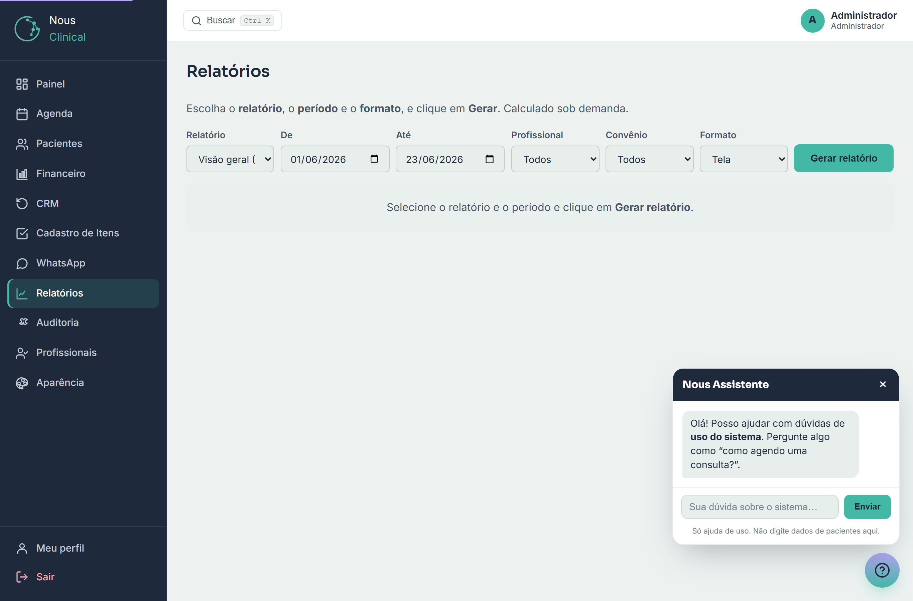
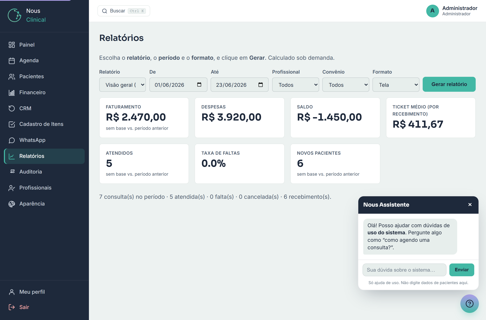
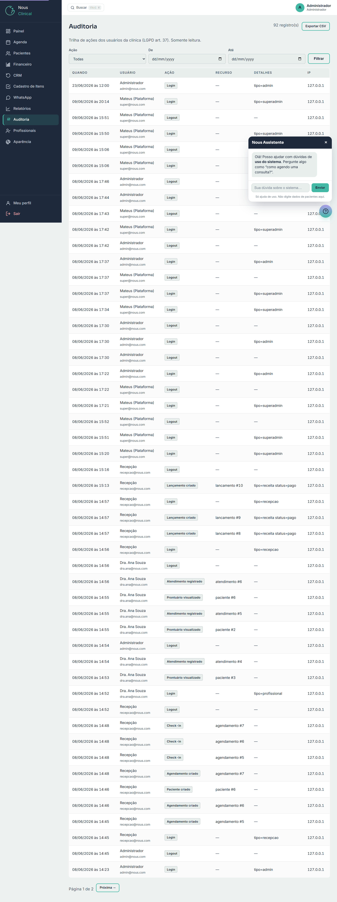

# Relatórios e Auditoria

Aqui é o "raio-X" da clínica: os **Relatórios** mostram em números como anda o
faturamento, os pacientes e a equipe; a **Auditoria** mostra quem fez o quê e
quando dentro do sistema. As duas telas servem para o gestor **acompanhar e
decidir** — não para o dia a dia da recepção.

> 🔒 **Quem acessa:** só o **administrador** vê **Relatórios** e **Auditoria**. A
> **recepção** e o **profissional** (médico) não enxergam essas telas no menu —
> são informações de gestão e dados sensíveis da operação.

---

## 1. Gerar um relatório

No menu lateral, clique em **Relatórios**. Você verá uma barra com algumas
escolhas e um botão para gerar. Nada é calculado até você clicar — assim a tela
abre rápido e você monta o relatório do seu jeito.

Para gerar, siga os passos:

1. Em **Relatório**, escolha o que você quer ver (a lista completa está mais
   abaixo, no item 2).
2. Em **De** e **Até**, escolha o **período** (data inicial e final). O sistema
   já vem com o período do **mês atual** preenchido.
3. (Opcional) Em **Profissional**, escolha um médico para ver só os números dele,
   ou deixe em **Todos**.
4. (Opcional) Em **Convênio**, escolha um convênio específico, ou deixe em
   **Todos**.
5. Em **Formato**, deixe em **Tela** para ver na hora, ou escolha **CSV** para
   baixar uma planilha (veja o item 3).
6. Clique em **Gerar relatório**.

O resultado aparece logo abaixo da barra.

> 💡 **Dica:** quer comparar meses? Gere um relatório com **De** e **Até** no mês
> passado, depois mude o período para o mês atual e gere de novo. A própria
> **Visão geral** já mostra a comparação com o período anterior automaticamente
> (veja abaixo).

> ⚠️ **Atenção:** o filtro de **Profissional** vale para os relatórios de
> dinheiro e agenda. Como despesas (aluguel, salário etc.) não pertencem a um
> médico específico, ao filtrar por um profissional as **despesas aparecem como
> R$ 0,00** — é o esperado, não é erro.

> 💡 **Dica:** os formatos **PDF** e **Excel** aparecem na lista como *"em
> breve"*. Por enquanto, use **Tela** para ver e **CSV** para exportar (o CSV
> abre no Excel normalmente — veja o item 3).

---

## 2. O catálogo de relatórios

Cada opção do campo **Relatório** responde a uma pergunta diferente sobre a
clínica. Em linguagem simples:

- **Visão geral (KPIs + comparativo)** — o painel resumo do período: faturamento,
  despesas, saldo, ticket médio, quantos pacientes foram atendidos, taxa de
  faltas e quantos pacientes novos entraram. Cada número ainda mostra se subiu
  (▲) ou caiu (▼) **em relação ao período anterior** de mesmo tamanho.

- **Faturamento e receita por médico** — quanto entrou no período e **quanto cada
  médico gerou** (consultas pagas). Mostra também o **repasse / comissão** de cada
  profissional, calculado a partir da comissão definida no cadastro dele.
- **Clientes e ticket médio** — quanto **cada paciente** gastou no período, quantas
  consultas pagou e o ticket médio por consulta. Útil para conhecer quem mais usa
  a clínica.
- **Pacientes por convênio** — a lista da sua **carteira ativa** de pacientes,
  organizada por convênio. É uma "foto" da base atual; não depende do período.
- **Pacientes por faixa etária** — o **perfil de idade** da sua base (0–17, 18–29,
  30–44, 45–59, 60+) e quanto cada faixa gastou no período.
- **Origem de leads (como conheceu)** — de **onde vêm seus pacientes** (indicação,
  redes, etc.), com quantidade e percentual. Ajuda a decidir onde investir em
  divulgação.
- **Dependência financeira por convênio** — **quanto cada convênio representa** da
  receita do período. Serve para enxergar o risco de depender demais de um único
  convênio.
- **DRE simplificado (resultado operacional)** — a continha do resultado:
  Receita Bruta − Impostos − Custos (insumos) − Despesas (aluguel, salário e
  demais) = **Resultado Operacional**. Considera apenas o que foi **efetivamente
  pago** no período.
- **Produtividade por profissional** — por médico, quantas consultas foram
  **agendadas, atendidas, faltaram e foram canceladas**, com a taxa de
  atendimento. Inclui também o **volume de procedimentos/exames** registrados.
- **Pacientes em risco de evasão** — pacientes ativos **sem atendimento há mais de
  180 dias e sem consulta futura marcada**. São candidatos a um "vamos te chamar
  de volta". Em cada paciente há o botão **Gerar mensagem**, que monta um rascunho
  de reativação para você revisar e enviar pelo WhatsApp (o mesmo recurso do CRM
  de Retornos — sem custo).

> 💡 **Dica:** o relatório de **Pacientes em risco de evasão** é ouro para reativar
> a clínica. Use o botão **Gerar mensagem** para chamar de volta quem sumiu há um tempo.

---

## 3. Exportar para CSV (abrir no Excel)

Quando você precisa trabalhar os números numa planilha, exporte em **CSV** — um
arquivo de planilha que **abre direto no Excel** (ou no Google Sheets / LibreOffice
Calc).

Há dois caminhos:

1. Na barra do topo, escolha o relatório e o período, deixe **Formato** em **CSV**
   e clique em **Gerar relatório**. O download começa.
2. Ou, depois de gerar um relatório na **Tela**, clique no botão **Exportar CSV**
   que aparece no canto do resultado.

O arquivo vai para a pasta de **Downloads** do seu computador. É só abrir com um
duplo clique.

> 💡 **Dica:** o arquivo usa **ponto e vírgula (;)** para separar as colunas e já
> vem com os acentos certos. Se o Excel abrir tudo numa coluna só, use
> *Dados → Texto para colunas* e escolha o separador **ponto e vírgula**.

> ⚠️ **Atenção:** a planilha pode conter dados de pacientes e financeiros. Trate
> o arquivo com cuidado, guarde em local seguro e **não compartilhe** com quem não
> deve ter acesso (proteção de dados / LGPD).

---

## 4. Auditoria: quem fez o quê, e quando

A **Auditoria** é a trilha de tudo o que acontece de importante no sistema: cada
login, cada paciente criado, cada agendamento, cada lançamento financeiro, cada
prontuário visualizado ou editado. Ela registra **quem** fez, **qual** ação,
**em que registro** e **a que horas**. É uma tela só de **leitura** — ninguém
edita nem apaga o histórico.

> 🔒 **Você vê só a sua clínica.** A trilha mostra apenas as ações dos usuários da
> **sua** clínica. Ações da plataforma (o super-administrador do Nous) e de outras
> clínicas **não aparecem** aqui — o isolamento é automático.

No menu lateral, clique em **Auditoria**.

A tabela tem as colunas:

- **Quando** — data e hora da ação.
- **Usuário** — quem fez (nome e e-mail).
- **Ação** — o que foi feito (ex.: *Login*, *Paciente criado*, *Lançamento pago*,
  *Prontuário visualizado*).
- **Recurso** — qual registro foi afetado.
- **Detalhes** e **IP** — informações extras e de onde a ação partiu.

Os registros aparecem do mais recente para o mais antigo. Quando há muitos, use os
botões **← Anterior** e **Próxima →** no rodapé para navegar entre as páginas.

### Filtrar a trilha

Para encontrar uma ação específica, use a barra de filtros:

1. Em **Ação**, escolha o tipo de ação que você procura (ex.: *Prontuário
   editado*), ou deixe em **Todas**.
2. Em **De** e **Até**, escolha o **período**.
3. Clique em **Filtrar**.

A tabela se ajusta ao que você pediu.

### Exportar a auditoria

Para guardar ou analisar fora do sistema, clique em **Exportar CSV** no topo da
tela. O arquivo respeita o **filtro que estiver aplicado** (mesma ação e mesmo
período que você selecionou).

> 💡 **Dica:** filtre **antes** de exportar. Assim a planilha já sai enxuta, só com
> o que interessa, em vez de baixar tudo.

> ⚠️ **Atenção:** a auditoria serve para confiança e transparência (e atende a
> exigências da LGPD). Ela mostra, por exemplo, **quem abriu um prontuário** — então
> oriente a equipe a só acessar o que for necessário para o trabalho.

---

## Perguntas rápidas

**A recepção ou o médico conseguem ver os Relatórios?**
Não. **Relatórios** e **Auditoria** são exclusivos do **administrador**. Os outros
papéis nem veem essas opções no menu.

**Gerei um relatório e os números ficaram em branco / zerados.**
Confira o **período** (campos **De** e **Até**) e os filtros. Se filtrou por um
**profissional**, lembre que as **despesas** aparecem como R$ 0,00 — isso é normal.
Também pode ser que não tenha havido movimento nesse intervalo.

**Por que não consigo exportar em PDF ou Excel?**
Esses formatos estão marcados como *"em breve"*. Por enquanto, use **Tela** para
visualizar e **CSV** para baixar uma planilha (o CSV abre no Excel).

**O CSV abriu tudo amontoado numa coluna só. E agora?**
O arquivo usa **ponto e vírgula** como separador. No Excel, vá em *Dados → Texto
para colunas* e escolha **ponto e vírgula** — as colunas se organizam.

**Dá para saber quem mexeu em um cadastro ou abriu um prontuário?**
Sim. É exatamente para isso que serve a **Auditoria**. Filtre pela **Ação**
desejada (ou pelo período) e veja quem fez e quando.
