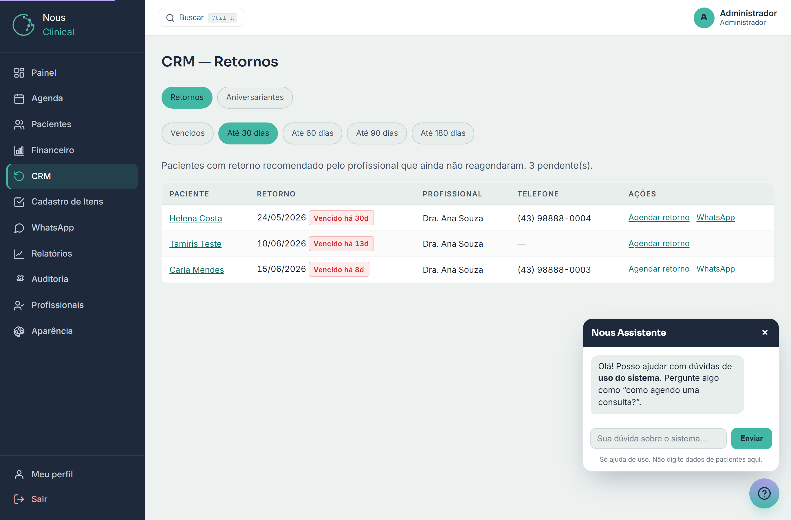
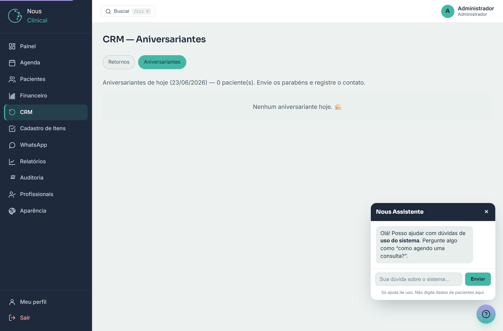

# CRM — Retornos e Aniversariantes

O **CRM** é a tela que ajuda a clínica a não perder o contato com o paciente.
Ele mostra duas listas prontas: pacientes que precisam **voltar para um retorno** e
pacientes que estão **fazendo aniversário hoje**. A ideia é simples: lembrar de quem
você lembraria de chamar de volta — só que sem depender da sua memória.

> 🔒 **Quem acessa:** **Recepção** e **Administrador**. O profissional (médico) não
> abre esta tela — ele só **recomenda o retorno** no atendimento, e a recepção/gestão
> faz o contato.

Você encontra tudo no menu lateral, em **CRM**. No topo da tela há duas abas:
**Retornos** e **Aniversariantes**.

---

## Retornos pendentes

Esta lista mostra os pacientes que o médico marcou para voltar e que **ainda não
remarcaram** uma consulta. É a sua lista de "ligar para reagendar".

### De onde vem o "retorno"

O retorno **não** é digitado aqui. Ele vem do **prontuário**: quando o médico termina
o atendimento, ele pode recomendar uma data de retorno (veja o capítulo **Atendimento**).
Essa data é que faz o paciente aparecer nesta lista.

> 💡 **Dica:** o paciente sai da lista sozinho assim que **remarca** uma consulta.
> Você não precisa "dar baixa" manualmente — basta agendar.

> ⚠️ **Atenção:** se o paciente se consultou de novo e o médico **não** recomendou um
> novo retorno, ele deixa de aparecer aqui. Para voltar à lista, o médico precisa marcar
> um novo retorno no próximo atendimento.

### A janela de dias

Logo abaixo das abas há um filtro com **Vencidos**, **Até 30 dias**, **Até 60 dias**,
**Até 90 dias** e **Até 180 dias**. Ele controla **até quando** olhar para frente:

- **Vencidos** — só quem já passou da data de retorno.
- **Até 30 dias** — vencidos **mais** quem está perto de vencer (nos próximos 30 dias).
- E assim por diante, até **180 dias**.

> 💡 **Dica:** comece o dia em **Vencidos** para resolver o mais urgente. Use **Até 30
> dias** quando quiser trabalhar de forma preventiva, chamando quem está prestes a vencer.

Na coluna **Retorno**, cada paciente mostra a data e uma etiqueta de situação:
**Vencido há X d** (passou da data), **Hoje** ou **Em X d** (ainda vai vencer).

### Como agir em cada paciente

Na coluna **Ações** de cada linha você tem dois atalhos:

1. Clique em **Agendar retorno** para abrir a tela de novo agendamento **já com o
   paciente preenchido**. É o caminho mais rápido para remarcar.
2. Clique em **Gerar mensagem** para montar um rascunho de mensagem de retorno e
   enviá-lo pelo WhatsApp (revisando antes) — veja **Gerar mensagem (Concierge)** logo abaixo.

### Gerar mensagem (Concierge)

Em cada paciente há o botão **Gerar mensagem**. Ao clicar, o sistema **monta um rascunho**
de mensagem de retorno já no nome do paciente. Você então:

1. **Revisa e edita** o texto na caixa que abre (é só um rascunho — ajuste à vontade).
2. Clica em **Abrir WhatsApp** para enviar com o texto que você aprovou, ou em **Copiar**
   para colar onde quiser. **Gerar de novo** traz outra versão.

> ✅ **Custo zero:** as mensagens são prontas e se adaptam ao paciente — não há nenhum custo
> por usar. (A clínica pode, opcionalmente, ligar um modo com IA para frases mais variadas;
> esse modo é ativado pela operadora.)

> ⚠️ **Atenção:** a ferramenta **sugere**, não envia. Nada sai sem você revisar e clicar em
> enviar. Ela **não vê o prontuário** — só sabe o nome, o profissional e há quanto tempo foi a
> última consulta.

> 💡 O mesmo botão **Gerar mensagem** aparece no relatório **Pacientes em risco de evasão**
> (em **Relatórios**), para reativar quem está há muito tempo sem voltar.

---

## Aniversariantes do dia

Esta aba mostra os pacientes que **fazem aniversário hoje**. É uma forma simples de
manter o relacionamento: uma mensagem de parabéns faz o paciente lembrar da clínica.

A lista traz **Paciente**, **Idade** e **Telefone**. Se não houver ninguém fazendo
aniversário, a tela mostra **Nenhum aniversariante hoje.**

### Como parabenizar e registrar

Na coluna **Ações** de cada paciente:

1. Clique em **WhatsApp** para abrir a conversa **com a mensagem de parabéns já
   pronta**. Confira e envie.
2. Depois de felicitar, clique em **Registrar contato**. Isso anota que a clínica fez
   o contato, para a equipe saber que aquele paciente já foi parabenizado.

> 💡 **Dica:** registrar o contato evita que duas pessoas da recepção mandem parabéns
> para o mesmo paciente. Quando você registra, aparece um aviso de confirmação na tela.

> ⚠️ **Atenção:** assim como nos retornos, o botão **WhatsApp** só existe quando o
> paciente tem telefone. Sem número, a linha mostra **sem telefone**.

---

## Perguntas rápidas

**Por que um paciente sumiu da lista de retornos?**
Provavelmente porque ele **remarcou** uma consulta (futura), ou porque se consultou de
novo e o médico não recomendou um novo retorno. Em ambos os casos, ele sai da lista.

**Eu consigo mudar a data de retorno por aqui?**
Não. A data de retorno é definida pelo médico no **atendimento**. O CRM apenas mostra
quem está pendente.

**A mensagem do WhatsApp já vai sozinha para o paciente?**
Não. O sistema só **abre o WhatsApp com o texto pronto**. Você confere a mensagem e
clica em enviar — nada é enviado automaticamente.

**Por que alguns pacientes não têm o botão de WhatsApp?**
Porque estão **sem telefone cadastrado**. Complete o cadastro do paciente em
**Pacientes** para habilitar o contato.
