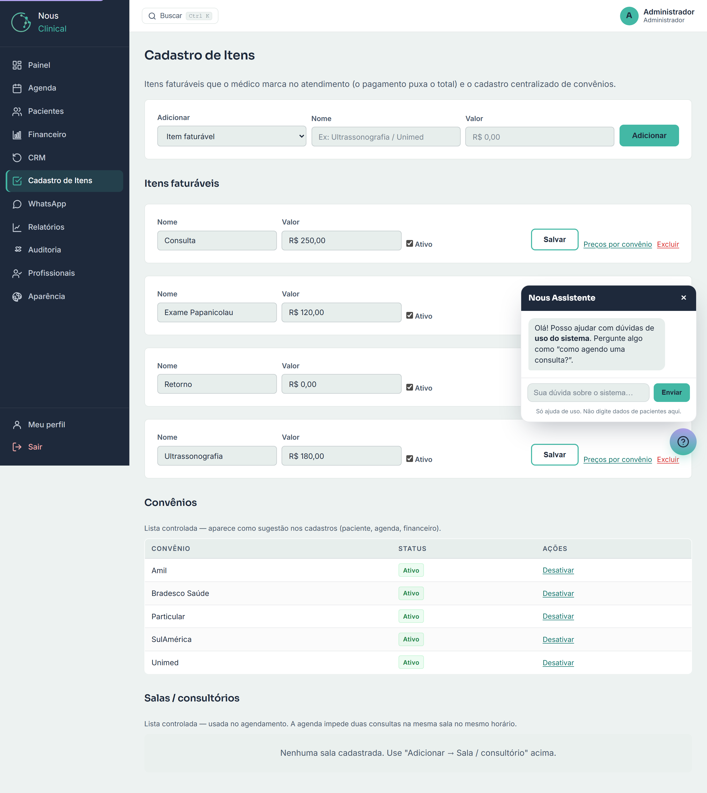

# Cadastro de Itens, Convênios e Salas

Esta tela é o "catálogo" da clínica. Aqui você cadastra, num só lugar, três coisas
que o resto do sistema usa o tempo todo:

- **Itens faturáveis** (procedimentos, exames, consultas...) com o valor padrão em R$;
- **Convênios** — a lista que aparece como opção no cadastro de paciente, na agenda e no financeiro;
- **Salas / consultórios** — usados no agendamento.

Pense nela como o "de-para" oficial da clínica: o que você cadastra aqui é o que
todo mundo vê depois nos menus de seleção, sem ninguém precisar digitar à mão.

> 🔒 **Quem acessa:** **Recepção** e **Administrador**. O profissional (médico) não
> abre esta tela.

Para abrir, clique em **Cadastro de Itens** no menu lateral.

---

## A barra de cima: "Adicionar"

No topo da tela há uma barra única que serve para cadastrar **qualquer um dos três
tipos**. Você escolhe o que quer criar no primeiro campo:

1. No campo **Adicionar**, escolha o tipo: **Item faturável**, **Convênio** ou **Sala / consultório**.
2. Digite o **Nome**.
3. Se for um item, preencha o **Valor** (em reais). Convênios e salas não têm valor.
4. Clique em **Adicionar**.

> 💡 **Dica:** o campo **Valor** só aparece quando você escolhe **Item faturável** —
> convênio e sala não têm preço aqui.

---

## Itens faturáveis (procedimentos)

São tudo que pode ser cobrado num atendimento: consulta, retorno, um exame, um
procedimento. O médico marca esses itens no prontuário e o financeiro **soma o
total** automaticamente — por isso é importante manter os valores certos.

### Como adicionar um item

1. Em **Adicionar**, escolha **Item faturável**.
2. Em **Nome**, escreva o nome do item (ex.: `Ultrassonografia`).
3. Em **Valor**, digite o preço padrão (ex.: `250,00`).
4. Clique em **Adicionar**.

O item aparece na lista **Itens faturáveis**, logo abaixo.

### Como editar ou desativar um item

Cada item da lista tem seus próprios campos, já preenchidos:

1. Altere o **Nome** ou o **Valor** direto na linha do item.
2. Para tirar o item de circulação sem apagá-lo, desmarque a caixa **Ativo**.
3. Clique em **Salvar**.

> 💡 **Dica:** desativar (desmarcar **Ativo**) é melhor do que excluir quando o item
> ainda pode voltar a ser usado, ou quando já foi cobrado em atendimentos antigos.
> Um item inativo simplesmente para de aparecer para escolha em novos atendimentos.

### Como excluir um item (e por que o histórico não some)

Na linha de cada item há o link **Excluir**.

1. Clique em **Excluir** na linha do item.
2. Confirme na pergunta que aparece.

> ⚠️ **Atenção:** excluir é definitivo — o item sai do catálogo. Mas **fique
> tranquilo:** os atendimentos antigos que já usaram esse item **continuam com o
> nome e o valor registrados**. O histórico e os relatórios não mudam; você só não
> poderá mais escolher esse item em novos atendimentos. Por isso a confirmação avisa
> que "o histórico de atendimentos é preservado".

---

## Tabela de Preços por convênio

O **Valor** de um item é o preço padrão (particular, sem convênio). Mas muitas vezes
cada convênio paga um valor diferente pelo mesmo procedimento. Para isso existe a
**tabela de preços por convênio**.

1. Na linha do item, clique em **Preços por convênio**.
2. Na nova tela, em **Convênio**, escolha um convênio da lista.
3. Em **Valor**, digite o preço daquele convênio para esse item.
4. Clique em **Salvar preço**.

O preço aparece na tabela logo abaixo. Repita para cada convênio que paga diferente.

Para tirar um preço da tabela, clique em **Remover** na linha dele e confirme.

> 💡 **Como o sistema usa isso:** no atendimento, quando o paciente tem convênio, o
> sistema usa **automaticamente** o preço daquele convênio. Se não houver preço
> cadastrado para o convênio, ele usa o **Valor** padrão do item. Ou seja: você só
> precisa cadastrar aqui os convênios que pagam um valor diferente do padrão.

> 💡 **Dica:** o número entre parênteses no link **Preços por convênio (2)** mostra
> quantos preços especiais já estão cadastrados para aquele item.

---

## Convênios

Esta é a **lista oficial de convênios da clínica**. Ela é importante porque, em todo
o sistema (cadastro de paciente, agenda, financeiro), o convênio é **escolhido nesta
lista** — ninguém digita o nome à mão. Isso evita erros de digitação e nomes
repetidos (como "Unimed", "unimed" e "UNIMED" virarem três convênios diferentes).

### Como adicionar um convênio

1. Em **Adicionar**, escolha **Convênio**.
2. Digite o **Nome** do convênio (ex.: `Unimed`).
3. Clique em **Adicionar**.

O convênio entra na lista **Convênios** com status **Ativo**.

> ⚠️ **Atenção:** se você tentar cadastrar um convênio que já existe, o sistema avisa
> e não cria de novo. Isso é proposital, para manter a lista limpa.

### Ativar e desativar um convênio

Convênios não são excluídos — eles são **ativados ou desativados**. Assim você não
perde os registros antigos ligados a ele.

1. Na lista **Convênios**, encontre o convênio.
2. Clique em **Desativar** para tirá-lo das opções (ou **Ativar** para voltar).

Um convênio **inativo** para de aparecer como opção em novos cadastros, mas continua
nos registros antigos onde já foi usado.

---

## Salas / consultórios

Aqui você cadastra as salas e consultórios da clínica. Elas aparecem no
agendamento, e o sistema usa essa lista para **impedir que duas consultas sejam
marcadas na mesma sala no mesmo horário** — evitando aquele clássico "marquei dois
pacientes na mesma sala".

### Como adicionar uma sala

1. Em **Adicionar**, escolha **Sala / consultório**.
2. Digite o **Nome** (ex.: `Consultório 1`).
3. Clique em **Adicionar**.

### Ativar e desativar uma sala

Assim como os convênios, as salas são **ativadas ou desativadas**, não excluídas:

1. Na lista **Salas / consultórios**, encontre a sala.
2. Clique em **Desativar** (ou **Ativar** para voltar).

> 💡 **Dica:** desative uma sala que estiver em reforma ou fora de uso. Ela some das
> opções de agendamento até você ativá-la de novo.

---

## Perguntas rápidas

**Qual a diferença entre desativar e excluir?**
Desativar só "esconde" o item/convênio/sala das novas escolhas — dá para reativar
depois. Excluir (disponível só para itens faturáveis) tira o item de vez do
catálogo, mas os atendimentos antigos que já usaram o item **continuam intactos**.

**Por que o convênio não tem um campo para digitar na agenda/cadastro?**
De propósito. O convênio é sempre escolhido nesta lista oficial, para não haver nomes
repetidos ou com erro de grafia. Se faltar um convênio na lista, cadastre-o aqui
primeiro.

**Cadastrei um preço por convênio mas o atendimento cobrou outro valor. Por quê?**
O sistema usa o preço do **convênio do paciente**. Confira se o paciente está com o
convênio certo no cadastro, e se existe um preço cadastrado para aquele convênio
naquele item. Sem preço específico, ele usa o **Valor** padrão.

**O médico pode mexer neste cadastro?**
Não. Apenas **Recepção** e **Administrador** acessam o Cadastro de Itens.
