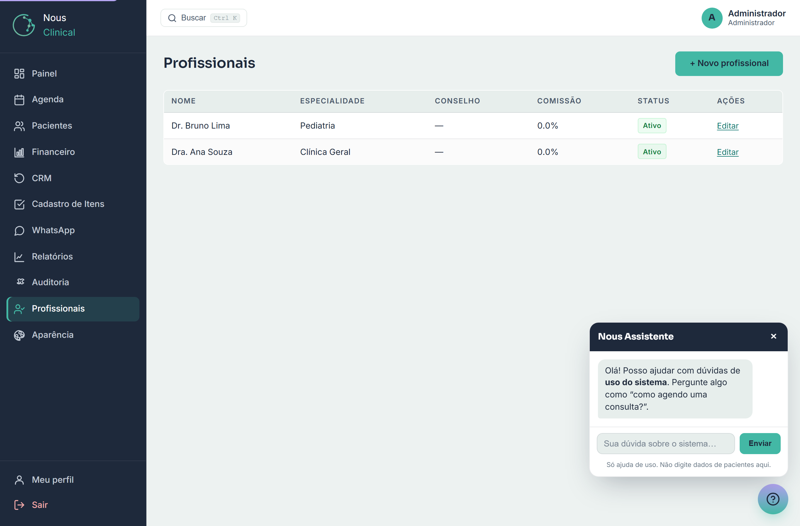
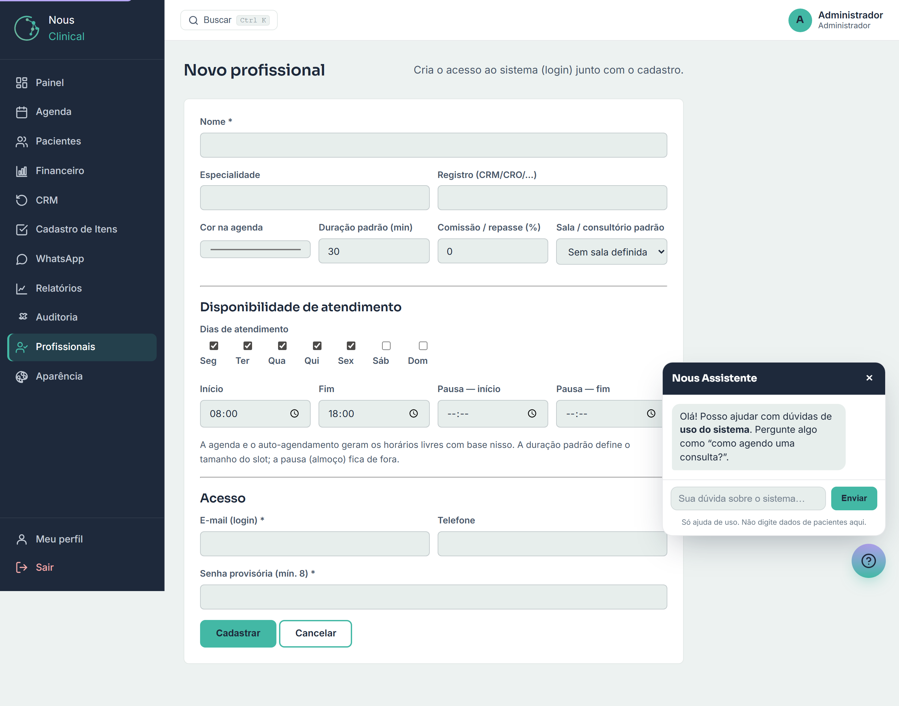

# Profissionais

Aqui você cadastra os profissionais de saúde da clínica (médico, dentista, psicólogo,
fisioterapeuta, nutricionista etc.). Cadastrar
um profissional faz duas coisas de uma vez só: registra os dados dele **e cria o acesso
ao sistema** (o login). Também é aqui que você define a **disponibilidade** de cada um —
os dias e horários que ele atende —, e é isso que monta os horários livres na agenda.

> 🔒 **Quem acessa:** só o **administrador** vê e usa esta tela. Recepção e
> profissionais não cadastram nem editam outros profissionais.

## A lista de profissionais

Ao abrir **Profissionais** no menu, você vê todos os cadastrados, com nome,
especialidade, conselho, comissão e o **Status** (Ativo ou Inativo).

A partir daqui você pode:

- Clicar em **+ Novo profissional** para cadastrar mais um.
- Clicar em **Editar** na linha de alguém para alterar os dados.

## Cadastrar um novo profissional

1. Clique em **+ Novo profissional**.
2. Preencha o **Nome** (obrigatório).
3. Em **Especialidade**, escreva a área dele (ex.: *Pediatria*, *Clínica Geral*).
4. Em **Registro (CRM/CRO/…)**, coloque o número do conselho (CRM para médicos, CRO
   para dentistas, e assim por diante).
5. Escolha a **Cor na agenda**. Cada profissional tem uma cor; é assim que você bate
   o olho na agenda e sabe de quem é cada consulta.
6. Defina a **Duração padrão (min)** da consulta (ex.: 30 minutos). É o tamanho de
   cada horário que o sistema vai oferecer para esse profissional.
7. Em **Comissão / repasse (%)**, informe o percentual de repasse, se houver. Pode
   deixar **0** se não usar.
8. Em **Sala / consultório padrão**, escolha a sala onde ele costuma atender. Ela já
   vem preenchida ao marcar uma consulta com esse profissional.

### Disponibilidade de atendimento

Esta parte é importante: é o que diz ao sistema **quando** o profissional atende. Com
base nela, a agenda e o agendamento online mostram só os horários realmente livres.

1. Em **Dias de atendimento**, marque os dias da semana que ele trabalha (Seg, Ter,
   Qua…). Por padrão, já vêm marcados de segunda a sexta.
2. Preencha **Início** e **Fim** (ex.: das 08:00 às 18:00) — a faixa do dia em que ele atende.
3. Se ele para para almoço ou outra pausa, preencha **Pausa — início** e
   **Pausa — fim** (ex.: 12:00 às 13:00). Nesse intervalo, nenhum horário é oferecido.
   Se não tem pausa, é só deixar os dois campos em branco.

> 💡 **Dica:** a **duração padrão** define o tamanho de cada horário, e a **pausa**
> fica de fora. Exemplo: atendendo das 08:00 às 12:00 com consultas de 30 minutos, o
> sistema cria horários de 30 em 30 (08:00, 08:30, 09:00…) e pula o almoço. É assim
> que a agenda sabe quais horários estão livres para marcar.

### Acesso (o login do profissional)

Ainda no cadastro, na parte **Acesso**, você cria o login dele:

1. Preencha o **E-mail (login)** — é com esse e-mail que ele entra no sistema.
2. **Telefone** é opcional.
3. Em **Senha provisória (mín. 8)**, defina uma primeira senha (no mínimo 8
   caracteres). Combine com o profissional para ele trocá-la depois, se preferir.
4. Clique em **Cadastrar**.

Pronto: o profissional já aparece na lista e já consegue entrar no sistema com esse
e-mail e senha.

> ⚠️ **Atenção:** cada e-mail só pode ser usado por uma pessoa. Se aparecer "Já existe
> um usuário com esse e-mail", use outro endereço. E a senha precisa ter **pelo menos
> 8 caracteres**, senão o cadastro não é concluído.

## Editar um profissional

1. Na lista, clique em **Editar** na linha da pessoa.
2. Ajuste o que precisar (especialidade, cor, duração, sala, comissão e a
   disponibilidade) e clique em **Salvar**.

> 💡 **Dica:** o **e-mail de login não é alterado** por aqui. A tela de edição mexe nos
> dados do profissional e na disponibilidade, mas não troca o login dele.

## Ativar ou desativar um profissional

Quando alguém sai da clínica, **não apague** o cadastro — basta desativar. Assim você
bloqueia o acesso dele, mas todo o histórico (agendamentos e atendimentos antigos)
continua guardado.

1. Clique em **Editar** na linha da pessoa.
2. Lá embaixo, **desmarque** a opção **Profissional ativo**.
3. Clique em **Salvar**.

Para reativar depois, é só editar de novo e marcar **Profissional ativo**. Na lista, o
**Status** mostra **Ativo** ou **Inativo** para você saber quem está liberado.

> ⚠️ **Atenção:** desativar bloqueia o **acesso** do profissional ao sistema, mas
> preserva o histórico. É o jeito certo de "tirar" alguém sem perder os dados.

## Perguntas rápidas

**Preciso cadastrar o login do profissional em outro lugar?**
Não. Ao cadastrar o profissional, o acesso (e-mail + senha) é criado junto, na mesma tela.

**Por que os horários livres da agenda mudam de um profissional para outro?**
Porque cada um tem a própria disponibilidade (dias, horário e pausa) e a própria
duração de consulta. A agenda monta os horários a partir disso.

**O profissional saiu da clínica. Apago o cadastro?**
Não apague. **Desative** (desmarque **Profissional ativo** ao editar). Ele perde o
acesso, mas o histórico de consultas fica preservado.

**Esqueci de marcar a pausa do almoço. E agora?**
É só **Editar** o profissional, preencher **Pausa — início** e **Pausa — fim** e
salvar. Os horários do almoço deixam de ser oferecidos na agenda.
