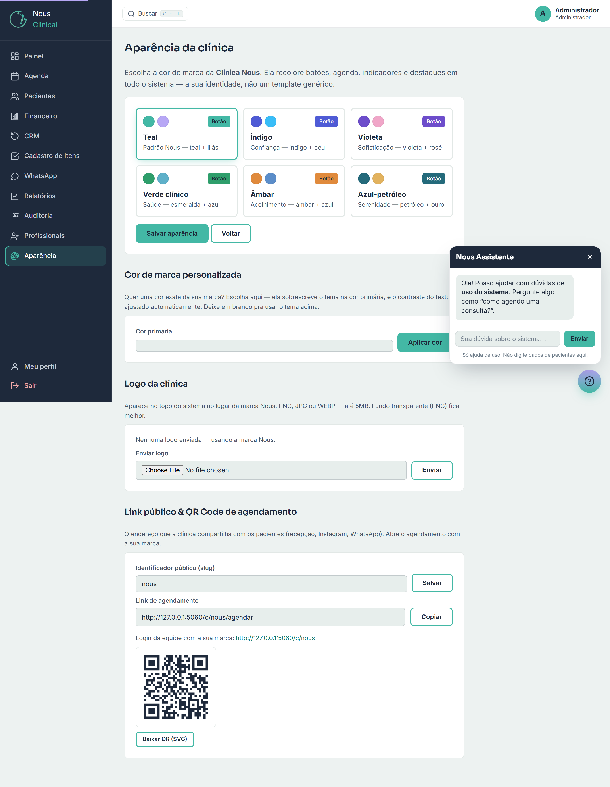

# Personalização da Marca (Aparência)

Esta tela deixa o sistema com a **cara da sua clínica**: a cor da sua marca, a sua
logo no topo e nos documentos, e um **link público + QR Code** para os pacientes
agendarem sozinhos. Em vez de um sistema genérico, todo mundo vê a sua identidade.

> 🔒 **Quem acessa:** só o **Administrador**. Recepção e profissionais não veem
> esta tela.

Você chega nela pelo menu lateral, em **Aparência**.

A tela é dividida em quatro blocos, de cima para baixo:

1. **Aparência da clínica** — os 6 temas prontos.
2. **Cor de marca personalizada** — uma cor exata sua (opcional).
3. **Logo da clínica** — sua imagem no topo e nos documentos.
4. **Link público & QR Code de agendamento** — o endereço e o QR para os pacientes.

Vamos um a um.

---

## 1. Escolher o tema (recolore o sistema inteiro)

O tema é o conjunto de cores da sua clínica. Ao salvar, ele **recolore botões,
agenda, indicadores e destaques em todo o sistema** — não só esta tela.

São **6 temas prontos** para escolher:

| Tema | Estilo |
|---|---|
| **Teal** | Padrão Nous — teal + lilás |
| **Índigo** | Confiança — índigo + céu |
| **Violeta** | Sofisticação — violeta + rosé |
| **Verde clínico** | Saúde — esmeralda + azul |
| **Âmbar** | Acolhimento — âmbar + azul |
| **Azul-petróleo** | Serenidade — petróleo + ouro |

Cada opção mostra uma **amostra das cores** e um mini **Botão** de exemplo, para
você prever como vai ficar.

**Como trocar:**

1. No bloco **Aparência da clínica**, clique no quadradinho do tema que você quer.
   Ele fica marcado (com uma borda destacada).
2. Clique em **Salvar aparência**.
3. O sistema avisa que a aparência foi atualizada. **Recarregue a página** (atalho:
   tecla **F5**) para ver a cor nova em todo o sistema.

> 💡 **Dica:** o botão **Voltar** ao lado de Salvar leva você de volta ao Painel
> sem mudar nada. Só clicar num tema **não** muda nada sozinho — a troca só vale
> depois de **Salvar aparência**.

---

## 2. Cor de marca personalizada (sua cor exata)

Os 6 temas já cobrem a maioria dos casos. Mas se a sua clínica tem uma cor
**exata** (aquela do seu logotipo, por exemplo), você pode usá-la aqui. Essa cor
**sobrescreve o tema** na cor principal do sistema.

**Como aplicar a sua cor:**

1. Vá ao bloco **Cor de marca personalizada**.
2. Clique no campo **Cor primária**. Abre um seletor de cores — escolha a cor
   visualmente ou digite o **código da cor** (formato *hex*, tipo `#43B8A5`).
3. Clique em **Aplicar cor**.
4. **Recarregue a página** (F5) para ver o resultado no sistema todo.

Quando há uma cor personalizada ativa, a tela mostra um aviso azul no topo
informando qual é a cor e lembrando que **ela tem prioridade sobre o tema**.

> 💡 **Dica:** não se preocupe com a cor do texto sobre os botões. O sistema
> ajusta o contraste automaticamente para o texto continuar legível.

> ⚠️ **Atenção — cor x tema:** a cor personalizada **vence** o tema. Por isso, se
> você depois escolher um tema lá em cima (passo 1) e clicar em **Salvar
> aparência**, o sistema **remove a sua cor personalizada** e passa a usar o tema.
> É de propósito: vale sempre a sua **última escolha**. O próprio sistema avisa
> quando isso acontece.

**Para voltar ao tema (remover a cor):**

1. No bloco **Cor de marca personalizada**, clique em **Remover cor (voltar ao
   tema)**.
2. Pronto — o sistema volta a usar o tema que você tinha escolhido. Recarregue (F5)
   para conferir.

---

## 3. Logo da clínica

A logo da sua clínica aparece em **três lugares**:

- no **topo do sistema**, no lugar da marca Nous;
- no **portal público** (a tela que o paciente vê ao agendar);
- nos **PDFs de receita e atestado** que você gera no atendimento.

**Como enviar a sua logo:**

1. Vá ao bloco **Logo da clínica**.
2. Clique em **Choose File** (escolher arquivo) e selecione a imagem da sua logo
   no computador.
3. Clique em **Enviar**.
4. A logo aparece na tela e já passa a valer no topo do sistema.

**Formatos aceitos e tamanho:**

- Aceita **PNG, JPG ou WEBP**, com até **5 MB**.
- **PNG com fundo transparente fica melhor** (a logo "encaixa" sem um quadrado
  branco em volta).

> ⚠️ **Atenção:** arquivo **SVG não é aceito** — se você tentar enviar um, o
> sistema avisa "Formato não suportado. Use PNG, JPG ou WEBP." Peça ao seu
> designer um PNG da logo.

**Para trocar a logo:** é só repetir o passo a passo enviando a imagem nova — ela
substitui a anterior.

**Para remover a logo:**

1. No bloco **Logo da clínica**, clique em **Remover logo**.
2. Confirme. O sistema volta a mostrar a marca **Nous** no topo.

---

## 4. Link público & QR Code de agendamento

Aqui você cria o **endereço público da clínica** — o link que você passa para os
pacientes (na recepção, no Instagram, no WhatsApp). Quem abre esse link cai numa
tela de agendamento **com a sua marca** (sua cor e sua logo).

### 4.1. O identificador público (slug)

O **slug** é o "apelido" da sua clínica dentro do endereço. Ele forma o link
público. Por exemplo, se o slug é `clinica-centro`, o link de agendamento fica
parecido com `.../c/clinica-centro/agendar`.

**Regras do identificador:**

- no mínimo **3 caracteres**;
- só **letras, números e hífen** (`-`) — sem espaços, acentos ou símbolos;
- precisa ser **único** na plataforma (se já estiver em uso por outra clínica, o
  sistema avisa e você escolhe outro).

**Como definir:**

1. No bloco **Link público & QR Code de agendamento**, escreva o identificador no
   campo **Identificador público (slug)** — por exemplo `clinica-centro`.
2. Clique em **Salvar**.
3. O sistema confirma "Endereço público atualizado" e libera o link e o QR Code
   logo abaixo.

> 💡 **Dica:** escolha algo curto e fácil de lembrar — o nome da clínica ou do
> bairro funciona bem. Pode digitar com letras maiúsculas ou espaços que o sistema
> ajeita sozinho (vira minúsculas e troca espaço por hífen).

### 4.2. O link de agendamento e o QR Code

Depois de salvar o identificador, aparecem:

- o campo **Link de agendamento** (já preenchido) com um botão **Copiar**;
- logo abaixo, o **QR Code**, gerado **automaticamente** a partir do seu
  identificador, com o botão **Baixar QR (SVG)**.

**Para pegar o link:**

1. Clique em **Copiar** ao lado do **Link de agendamento**.
2. Pronto — o link está na área de transferência. Agora é só colar onde você quiser
   (WhatsApp, bio do Instagram, site, e-mail).

**Para baixar o QR Code:**

1. Clique em **Baixar QR (SVG)**.
2. O arquivo do QR Code é salvo no seu computador.

**Como usar o QR Code e o link:**

- **Imprimir o QR na recepção** (num cartaz ou no balcão) — o paciente aponta a
  câmera do celular e já cai no agendamento.
- **Postar no Instagram / WhatsApp** — coloque a imagem do QR ou o link nos posts e
  na bio.
- O paciente que abrir esse link vê a tela de agendamento **só com os profissionais
  da sua clínica** e com a **sua marca**.

> 💡 **Dica:** o QR Code e o link sempre apontam para o agendamento atualizado —
> você não precisa gerar de novo quando muda a cor ou a logo. Só precisa baixar/
> copiar outra vez se você **mudar o identificador**.

> ⚠️ **Atenção:** se você **trocar o identificador** depois, o link e o QR antigos
> deixam de funcionar. Se já imprimiu cartazes, evite mudar — ou imprima de novo.

---

## Perguntas rápidas

**Mudei o tema mas o sistema continua igual. E aí?**
Recarregue a página (tecla **F5**). A cor nova vale no sistema todo, mas o navegador
precisa recarregar para mostrar.

**Escolhi uma cor personalizada e agora quero um dos temas prontos.**
Pode escolher o tema e clicar em **Salvar aparência** — o sistema remove a cor
personalizada automaticamente e aplica o tema. (Se preferir, clique antes em
**Remover cor (voltar ao tema)**.)

**Posso enviar a logo em SVG?**
Não. Use **PNG, JPG ou WEBP** (até 5 MB). PNG com fundo transparente é o que fica
melhor.

**Preciso gerar o QR Code manualmente?**
Não. Assim que você salva o **identificador público**, o sistema gera o QR
sozinho. Você só clica em **Baixar QR (SVG)** para salvá-lo.

**A recepção pode mexer nisso?**
Não. Só o **Administrador** vê e altera a tela de Aparência.
