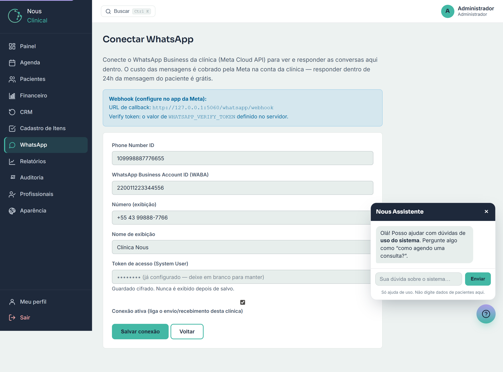
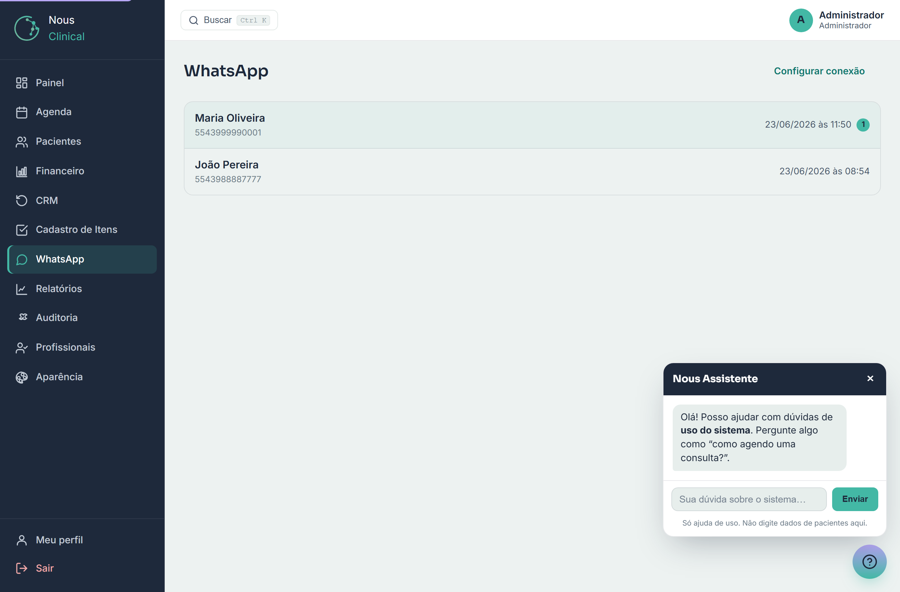
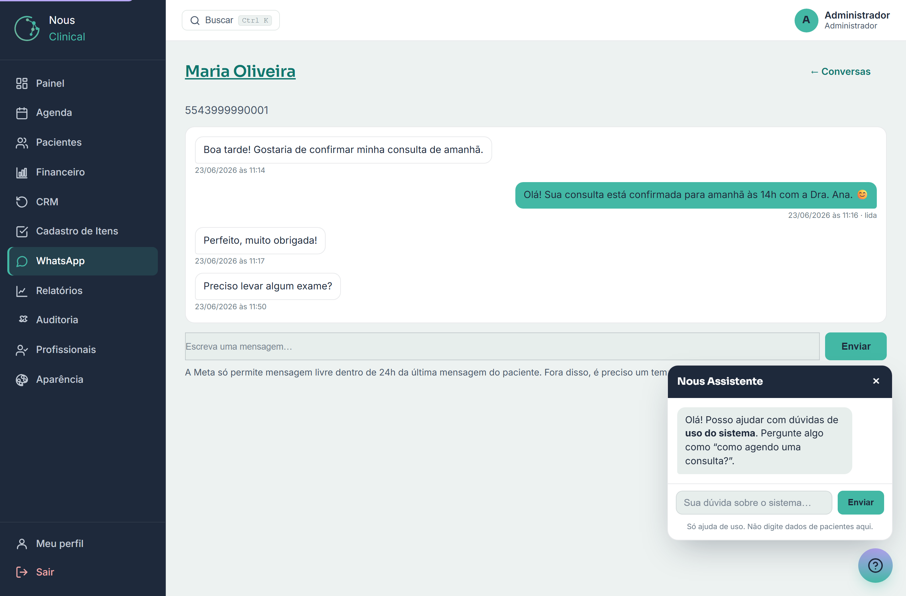

# WhatsApp Integrado

O WhatsApp Integrado deixa a clínica **conversar com os pacientes pelo WhatsApp sem
sair do Nous**. A clínica conecta o **próprio número de WhatsApp Business** e, a partir
daí, todas as mensagens que os pacientes mandam chegam numa **caixa de entrada** dentro
do sistema — onde a recepção lê e responde. É o mesmo número de sempre da clínica; muda
só o lugar de onde você responde.

> 🔒 **Quem acessa:** **quem conecta** o número é só o **Administrador** (na tela
> **Configurar conexão**). **Quem usa** a caixa de entrada para ler e responder são a
> **Recepção** e o **Administrador**. O **Profissional** não usa este módulo.

> ⚠️ **Importante: vem desligado.** O WhatsApp **não funciona sozinho**. Ele só começa a
> receber e enviar mensagens **depois que o Administrador conectar** o número da clínica
> (passo a passo abaixo). Antes disso, o módulo fica inativo de propósito — e **sem
> nenhum custo**.

---

## Antes de tudo: como o dinheiro funciona (leia com calma)

Esta é a parte mais importante do capítulo. Leia antes de conectar para não ter surpresa.

- **Quem cobra é a Meta** (a dona do WhatsApp, do Facebook e do Instagram), **não o
  Nous**. O Nous é só a tela onde você lê e responde — ele **não cobra por mensagem**.
- **Quem paga é a clínica.** A cobrança cai na **conta da Meta Business da própria
  clínica** (no cartão que a clínica cadastrar lá). O Nous nunca paga as mensagens por você.
- **Responder dentro de 24 horas é grátis.** Sempre que um paciente te manda uma
  mensagem, abre-se uma **janela de 24 horas** em que você pode responder à vontade,
  **sem pagar nada**. Esse é o uso do dia a dia da recepção (confirmar consulta, tirar
  dúvida, reagendar) — então, na prática, **o atendimento normal sai de graça**.
- **Fora das 24 horas, custa centavos.** Se você precisar **começar** uma conversa, ou
  responder depois que a janela de 24h fechou, a Meta exige uma **mensagem-modelo**
  (texto pré-aprovado) e cobra alguns **centavos por mensagem**. Quem paga é a clínica.

> 💡 **Resumo do bolso:** paciente mandou mensagem e você respondeu logo? **Grátis.**
> Você quis puxar conversa do nada, ou respondeu dias depois? **Aí a Meta cobra
> centavos** — e a conta é da clínica, não do Nous.

> ⚠️ **Atenção:** o Nous **não controla** os preços da Meta nem dá desconto neles. Os
> valores são definidos pela Meta e podem mudar. Para conhecer os valores atuais, a
> clínica acompanha o painel da Meta Business.

---

## Passo 1 — Conectar o WhatsApp (só o Administrador)

Para conectar, a clínica precisa de **duas informações** que ficam no painel da Meta /
Facebook Business: o **identificador do número** e um **token de acesso**. Conseguir
esses dois itens é um passo técnico, feito **uma única vez** — peça ajuda ao **suporte
ou ao TI** para obtê-los e para registrar o endereço de webhook (explicado mais abaixo).

1. No menu lateral, clique em **WhatsApp**.
2. Clique em **Configurar conexão** (canto superior direito). Você cai na tela
   **Conectar WhatsApp**.
3. Preencha os campos:
   - **Phone Number ID** — é o **identificador do número** (só números), copiado do
     painel da Meta. Não é o telefone que aparece para o paciente; é um código interno
     da Meta para aquele número.
   - **WhatsApp Business Account ID (WABA)** — o código da conta de WhatsApp Business da
     clínica, também copiado do painel da Meta.
   - **Número (exibição)** — o telefone como você quer que apareça aqui dentro, ex.:
     `+55 43 99999-8888`. É só visual, para a equipe reconhecer o número.
   - **Nome de exibição** — o nome da clínica que identifica essa conta (ex.: *Clínica
     Nous*).
   - **Token de acesso (System User)** — a **senha de acesso** que autoriza o Nous a
     enviar e receber pelo número da clínica. Cole o token copiado da Meta.
4. Marque **Conexão ativa**. É essa caixinha que **liga** o envio e o recebimento de
   mensagens para a sua clínica. Sem ela marcada, fica tudo parado.
5. Clique em **Salvar conexão**.

> 🔒 **O token fica guardado em segurança.** Depois de salvo, o Nous **nunca mais
> mostra** o token na tela (você vê só `••••••••`). Se algum dia precisar trocar o
> token, é só **colar um novo** nesse campo e salvar de novo. Se deixar o campo **em
> branco**, o token atual é **mantido** — ou seja, salvar outras alterações não apaga o
> token.

> 💡 **Sobre o "webhook":** no alto da tela aparece um endereço (a **URL de callback**)
> que precisa ser **registrado no painel da Meta** para que as mensagens dos pacientes
> cheguem até aqui. Esse cadastro é técnico e se faz **uma vez só** — o **suporte / TI
> ajuda nesse passo**. Você, administrador, não precisa entender os detalhes; só repassar
> esse endereço para quem for configurar.

---

## Passo 2 — A caixa de entrada (Recepção e Administrador)

Depois de conectado, é só usar. Clique em **WhatsApp** no menu para abrir a **caixa de
entrada** — a lista de todas as conversas da clínica.

- Cada linha é **uma conversa** com um paciente, mostrando o **nome** (quando o número
  bate com um paciente cadastrado) e o **horário** da última mensagem.
- As conversas com **mensagens não lidas** aparecem em **destaque**, com uma **bolinha
  com o número** de mensagens novas — assim você vê de relance o que falta responder.
- As conversas mais recentes ficam **no topo**.

> 💡 **Dica:** se o paciente já estiver **cadastrado** com o mesmo telefone, o Nous
> reconhece e mostra o **nome do paciente** na conversa (e dá para abrir a ficha dele
> pelo nome). Se o número não bater com nenhum cadastro, aparece o número e a conversa
> fica marcada como **não vinculada a um paciente**.

---

## Passo 3 — Abrir e responder uma conversa

1. Na caixa de entrada, **clique na conversa** que você quer ver.
2. Você vê o **histórico**: as mensagens do **paciente** de um lado e as **suas
   respostas** do outro, cada uma com **horário**. Nas suas respostas aparece também o
   **status** (enviada, entregue, lida).
3. Para responder, escreva no campo **Escreva uma mensagem…** lá embaixo.
4. Clique em **Enviar**. A mensagem vai pelo WhatsApp e já aparece no histórico.
5. Para voltar à lista, clique em **← Conversas**.

> ⚠️ **A regra das 24 horas (a mesma do dinheiro):** o campo de texto livre só funciona
> **dentro de 24 horas** da última mensagem do paciente — e, nessa janela, responder é
> **grátis**. Passou das 24h sem o paciente escrever de novo? Aí a Meta **não deixa**
> mandar texto livre: é preciso usar uma **mensagem-modelo aprovada**, que **custa
> centavos** (pagos pela clínica). Por isso vale o hábito de **responder logo** — é mais
> rápido para o paciente e **não custa nada**.

> ⚠️ **Atenção:** abrir uma conversa **marca as mensagens dela como lidas** e zera o
> contador de não lidas. Se você só quer "dar uma olhada" sem perder o destaque de
> pendência, lembre que ao abrir já conta como lida.

---

## Lembrete de consulta automático por WhatsApp

Além do e-mail, o Nous pode mandar o **lembrete de consulta** (a mensagem que avisa o
paciente, na véspera, do dia e horário) **automaticamente pelo WhatsApp** — com um link
para o paciente **confirmar a presença em um clique**. Não é a recepção que digita: o
sistema dispara sozinho.

> ⚠️ **Tem uma condição importante.** Esse lembrete sai pelo WhatsApp **só quando todas
> estas coisas estão prontas**:
> 1. o **módulo WhatsApp** está ligado e a clínica está **conectada** (passos 1 e 2 acima);
> 2. a clínica tem uma **mensagem-modelo (template) aprovada pela Meta** configurada para
>    o lembrete.

Por que o template é obrigatório? Porque o lembrete é uma mensagem que a clínica
**começa** (o paciente não escreveu antes) e geralmente sai **fora da janela de 24 horas**.
Como você viu no início do capítulo, a Meta **só permite** mensagem proativa fora das 24h
**por mensagem-modelo aprovada** — e cobra alguns centavos por ela, na conta da clínica.

> 💡 **Sem template, ninguém fica sem lembrete.** Se a clínica ainda não tem a
> mensagem-modelo aprovada, o lembrete daquele paciente **cai para o e-mail**
> automaticamente (quando o paciente tem e-mail cadastrado). Ou seja: o WhatsApp é o
> caminho preferido quando está tudo configurado; o e-mail é a rede de segurança.

> 🔒 **Quem configura:** ligar o módulo, conectar o número e ter o **template aprovado**
> é coisa do **Administrador** com o suporte/TI (aprovar um modelo de mensagem na Meta é
> um passo técnico, feito uma vez). A recepção não precisa fazer nada para o lembrete
> automático funcionar.

---

## Perguntas rápidas

**O Nous cobra alguma coisa pelas mensagens de WhatsApp?**
Não. O Nous não cobra por mensagem. Quem cobra é a **Meta**, e a conta cai na **conta
da clínica** na Meta Business. Responder o paciente dentro de 24h é **grátis**.

**Então quando é que eu pago?**
Só quando você **inicia** uma conversa ou responde **depois das 24 horas** — aí a Meta
exige uma mensagem-modelo e cobra **centavos por mensagem**, pagos pela clínica. No
atendimento normal (paciente escreve, você responde na hora), **não há custo**.

**Posso usar o mesmo número de WhatsApp que a clínica já usa?**
Sim — a ideia é justamente conectar o **número da própria clínica**. O número precisa
estar habilitado como **WhatsApp Business** no painel da Meta; o suporte/TI orienta.

**A recepção consegue conectar o número?**
Não. **Conectar** é só do **Administrador**, na tela **Configurar conexão**. A recepção
**usa** a caixa de entrada (ler e responder), mas não mexe na conexão.

**O cliente mandou mensagem e não apareceu na lista. E agora?**
Confira com o administrador se a **Conexão ativa** está marcada e se o cadastro do
**webhook** na Meta foi feito (passo técnico do suporte/TI). Sem esses dois, as
mensagens dos pacientes não chegam até aqui.

**O lembrete de consulta sai sozinho pelo WhatsApp?**
Sim, **desde que** o módulo esteja conectado **e** a clínica tenha uma **mensagem-modelo
(template) aprovada pela Meta** para o lembrete. Faltando o template, o lembrete daquele
paciente **vai por e-mail** (se ele tiver e-mail cadastrado). Configurar o template é um
passo do administrador com o suporte/TI.

**Por que o lembrete precisa de uma mensagem-modelo?**
Porque o lembrete é uma mensagem que a **clínica inicia**, normalmente **fora das 24
horas** da última conversa. Nesse caso a Meta **só aceita** mensagem-modelo aprovada (e
cobra centavos por ela, na conta da clínica). É a mesma regra das 24 horas explicada no
começo do capítulo.
