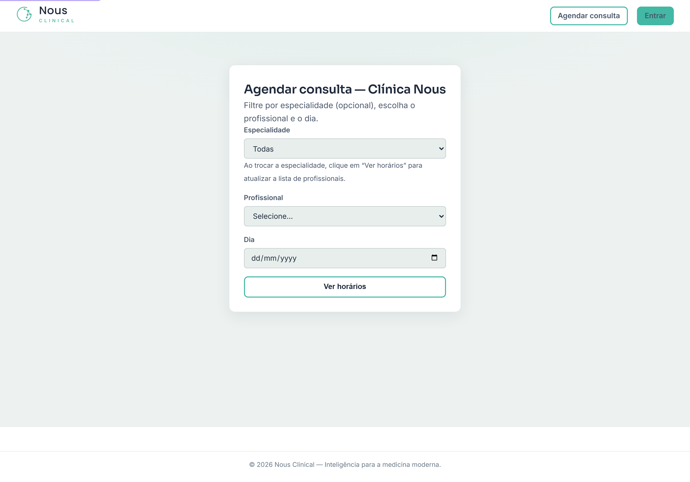

# Agendamento Online (Portal do Paciente)

O **Agendamento Online** é uma página pública da sua clínica onde o **próprio paciente
marca a consulta sozinho**, pela internet, **sem precisar de login**. Ele escolhe o
profissional e o dia, vê os horários livres, preenche os dados e pronto: a consulta cai
direto na agenda da clínica.

> 🔒 **Quem usa o quê:** quem **agenda** nessa tela é o **paciente** (qualquer pessoa com
> o link). Quem **liga, configura e divulga** o portal é a clínica — normalmente o
> **Administrador** (ele define a marca e a cor) e a **Recepção** (que recebe as consultas
> que chegam). O paciente não vê nada da agenda interna nem dos outros pacientes.

---

## O que é esse "portal" e de onde vem o link

Cada clínica tem o seu **endereço público próprio**, com a **sua marca** — o logo e a cor
da clínica aparecem na página. Esse endereço usa o **apelido (slug)** da clínica, definido
no capítulo **Personalização** (é o mesmo apelido que dá identidade ao portal e à tela de
login da sua clínica).

Na prática, você divulga **um link** (e/ou um **QR Code**) e o paciente abre a página de
agendamento já com a cara da sua clínica.

> 💡 **Dica:** o paciente **não cria conta, não tem senha**. É só abrir o link e marcar.
> Quanto menos passos, mais gente conclui o agendamento.

---

## Como o paciente marca a consulta (passo a passo)

É bom você conhecer o caminho que o paciente percorre, para conseguir orientá-lo se ele
ligar com dúvida.

1. O paciente abre o **link** (ou aponta a câmera para o **QR Code**) da clínica.
2. No alto aparece **Agendar consulta — [nome da clínica]**.
3. Em **Especialidade**, ele pode filtrar (é **opcional** — pode deixar em **Todas**).
   Se trocar a especialidade, ele clica em **Ver horários** para a lista de profissionais
   se atualizar.
4. Em **Profissional**, escolhe com quem quer se consultar.
5. Em **Dia**, escolhe a data (só datas de hoje em diante).
6. Clica em **Ver horários**.
7. A página mostra os **Horários livres** daquele dia. O paciente clica no horário desejado.
8. Preenche **Seu nome completo**, **CPF**, **Data de nascimento** e **WhatsApp**
   (todos obrigatórios). Pode informar **Convênio** e **Observações** (opcionais).
9. Clica em **Agendar**.
10. Aparece a confirmação **Consulta solicitada**, com paciente, data/hora e profissional,
    e o aviso de que a clínica vai confirmar pelo WhatsApp informado.

> 💡 **Os horários que aparecem já estão "limpos":** a lista de **Horários livres** respeita
> a **disponibilidade do profissional** (dias e faixa de atendimento) e os **bloqueios**
> que vocês marcaram na agenda (almoço, congresso, folga). Horário ocupado ou bloqueado
> **não aparece** para o paciente — então ele não consegue marcar em cima de outra consulta.

> ⚠️ **Atenção — o convênio é da sua lista, não texto livre:** o paciente só consegue
> escolher um convênio que a clínica **já cadastrou**. Qualquer outra coisa entra como
> **Particular**. Isso evita convênio inventado ou escrito errado.

---

## O que acontece depois que o paciente confirma

Quando o paciente clica em **Agendar**:

1. O sistema **cria o cadastro do paciente** (se ele ainda não existir) com o nome, CPF,
   nascimento, WhatsApp e convênio informados — ou reaproveita o cadastro, se já houver.
2. A consulta entra na **Agenda da clínica** com o status **agendado** (a mesma agenda que a
   recepção usa no dia a dia). A **sala** é a sala padrão do profissional.
3. A **Recepção** vê essa consulta como qualquer outra e dá continuidade: confirma, recebe,
   faz o check-in no dia.

> ⚠️ **"Agendado" não é "confirmado".** A consulta que entra pelo portal fica como
> **agendado** — ou seja, **solicitada**. Vale a pena a recepção dar uma olhada nessas
> consultas e confirmar com o paciente (a própria página avisa que a clínica vai confirmar
> pelo WhatsApp).

### O paciente pode confirmar a presença sozinho

A clínica pode enviar ao paciente um **link de confirmação** (pelo WhatsApp). Ao abrir esse
link, o paciente vê os dados da consulta e um botão para **confirmar a presença** —
e aí a consulta passa de **agendado** para **confirmado** na agenda, sem a recepção precisar
ligar. É um jeito simples de reduzir falta.

---

## Como divulgar (dicas para a clínica)

O portal só ajuda se o paciente souber que ele existe. Algumas ideias:

- 📌 **QR Code na recepção:** imprima o QR Code e cole no balcão, na sala de espera e na
  porta. Quem está esperando já remarca o retorno na hora.
- 📱 **Link na bio do Instagram** (e do WhatsApp Business): coloque o link de agendamento na
  bio para o paciente marcar direto pela rede social.
- 💬 **Mensagem padrão:** deixe o link pronto para a recepção mandar no WhatsApp
  ("Olá! Para marcar sua consulta, é só clicar aqui 👉 [link]").
- 🖨️ **Materiais impressos:** cartão de visita, receituário, panfleto — todos podem trazer
  o QR Code.

> 💡 **Dica:** como a página já vem com **o logo e a cor da sua clínica**, ela reforça a
> marca a cada vez que o paciente agenda. Configure a identidade no capítulo
> **Personalização** antes de sair divulgando.

---

## Perguntas rápidas

**O paciente precisa criar conta ou senha?**
Não. É só abrir o link e preencher os dados. Sem login.

**E se o paciente marcar em um horário que já está ocupado?**
Não dá — os horários ocupados e os bloqueios **nem aparecem** na lista de horários livres.
Se, por coincidência, alguém ocupar o horário no mesmo instante, o sistema avisa
"Esse horário acabou de ser ocupado" e pede para escolher outro.

**A consulta marcada pelo portal já está confirmada?**
Não. Ela entra como **agendado** (solicitada). A clínica confirma — ou o próprio paciente
confirma pelo link de confirmação enviado no WhatsApp.

**Onde eu vejo as consultas que chegaram pelo portal?**
Na **Agenda** normal da clínica, junto com as demais. Elas aparecem como agendamentos
comuns, prontas para a recepção confirmar e receber.

**Posso ter o portal com a cara da minha clínica (logo e cor)?**
Sim. O logo e a cor vêm da **Personalização** da clínica e aparecem automaticamente na
página de agendamento.
