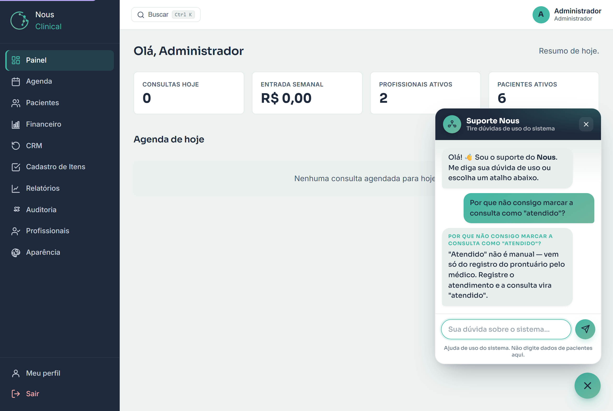

# Suporte de Ajuda (Suporte Nous)

> **Para que serve:** tirar dúvidas de **como usar o sistema**, na hora, sem sair da
> tela. **Quem usa:** toda a equipe (recepção, profissional, administrador).

O **Suporte Nous** é um ajudante que fica num balão no canto da tela. Você escreve a
dúvida em português ("como faço para agendar?", "onde vejo as contas a pagar?") — ou
clica num dos **atalhos de perguntas frequentes** — e ele responde na hora, buscando
na **central de ajuda do próprio sistema**, já respeitando o seu papel.

## Como usar

1. Clique no botão de ajuda (o **balão** no canto inferior direito da tela).
2. Escolha um dos **atalhos** sugeridos **ou** digite sua dúvida no campo
   **Sua dúvida sobre o sistema…**
3. Clique em **Enviar** (o ícone de avião). A resposta aparece na hora.

> 💡 **Dica:** seja direto e use palavras-chave — ex.: "bloquear agenda", "receber
> pagamento", "convênio". Se não achar de primeira, tente outras palavras.

## O que ele faz — e o que ele NÃO faz

- ✅ Explica **como usar** as telas e funções do Nous.
- ✅ Respeita o seu papel: não mostra para a recepção coisas de prontuário, por exemplo.
- ❌ **Não dá conselho clínico** (diagnóstico, medicação) — não é a função dele.
- ❌ **Não acessa dados reais** de pacientes, agenda ou financeiro. Ele te diz
  *onde clicar* para ver a informação; quem mostra o dado é o sistema, não ele.

> ⚠️ **Atenção:** por segurança e LGPD, **não** digite dados de paciente (nome, CPF,
> queixa) na caixa do suporte. Ele é só para dúvidas de uso.

## Custo: zero, sempre

O Suporte Nous **não tem custo nenhum**. Ele não usa inteligência artificial paga —
apenas **procura a resposta na central de ajuda** que já vem dentro do sistema. Por
isso está **sempre ligado** para toda a equipe, sem configuração e sem mensalidade
extra.

> 🔒 **Para a PGS (opcional):** existe ainda um modo **assistente com IA** (respostas
> mais "conversadas"), que vem **desligado** e só é ativado pela plataforma mediante
> uma chave paga. Não é necessário: o suporte gratuito já responde às dúvidas de uso.
> Detalhes em [Status de Produção](../PRODUCAO-STATUS-PENDENCIAS.md).

## Perguntas rápidas

**O suporte vê o prontuário ou os dados dos meus pacientes?**
Não. Ele não acessa nenhum dado real. Só conhece o "manual" de como o sistema funciona.

**Por que ele às vezes diz que não achou?**
Porque ele responde **só** com base na central de ajuda. Se a dúvida fugir disso (ou
for sobre algo que o sistema ainda não faz), ele avisa em vez de inventar. Nesse caso,
tente outras palavras ou fale com o administrador da clínica.

**As respostas melhoram com o tempo?**
Sim. A central de ajuda é atualizada conforme o sistema evolui — e o suporte passa a
responder as novidades automaticamente.
