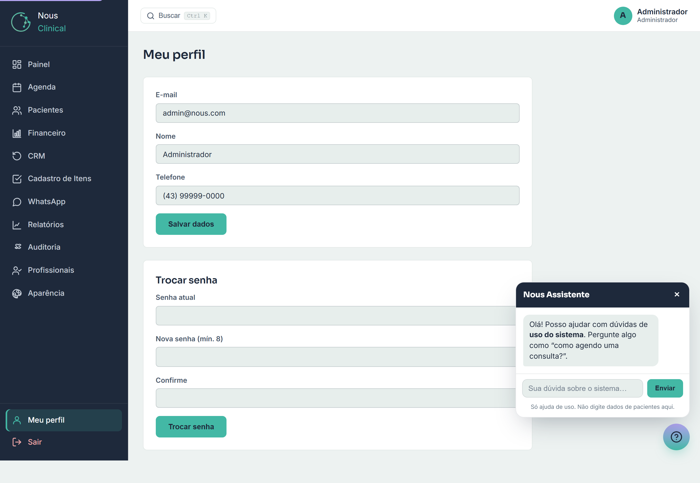

# Meu Perfil e Senha

Aqui você atualiza seus próprios dados (nome e telefone) e troca sua senha de acesso. Esta tela é igual para **todos**: administrador, recepção e profissional — cada um cuida apenas do seu próprio cadastro.

Para abrir, clique em **Meu perfil** no menu lateral (lá embaixo, perto de **Sair**).

## Editar seu nome e telefone

1. No menu lateral, clique em **Meu perfil**.
2. No primeiro quadro, ajuste o campo **Nome** e/ou **Telefone**.
3. Clique em **Salvar dados**.

> 💡 **Dica:** mantenha o **Telefone** certo. É por ele (e pelo e-mail) que a clínica fala com você quando precisar — inclusive para te enviar um link caso você esqueça a senha.

> ⚠️ **Atenção:** o campo **E-mail** aparece travado e não pode ser alterado por aqui, porque ele é o seu login. Se o seu e-mail mudou de verdade, peça ao **administrador** da clínica para ajustar.

## Trocar sua senha

Use o segundo quadro, **Trocar senha**, quando quiser definir uma senha nova (você lembra da atual e só quer mudá-la).

1. Em **Senha atual**, digite a senha que você usa hoje.
2. Em **Nova senha (mín. 8)**, escolha a nova senha — ela precisa ter **pelo menos 8 caracteres**.
3. Em **Confirme**, digite a nova senha de novo, igualzinha.
4. Clique em **Trocar senha**.

> 🔒 **Quem acessa:** todos os papéis trocam a própria senha por aqui. Ninguém troca a senha de outra pessoa nesta tela.

> ⚠️ **Atenção:** se você errar a **Senha atual**, ou se a **Nova senha** e a **Confirme** não forem iguais, o sistema avisa e a troca não acontece. Confira e tente de novo.

## Verificação em duas etapas (2FA)

É uma **camada extra de segurança**: além da senha, o login passa a pedir um **código de 6 dígitos** que muda a cada 30 segundos num app do seu celular. Assim, mesmo que alguém descubra sua senha, não entra sem o seu telefone. **Recomendado principalmente para administradores.**

**Como ativar:**

1. Instale no celular um app autenticador — **Google Authenticator**, **Authy** ou **Microsoft Authenticator** (todos gratuitos).
2. No **Meu perfil**, no quadro **Verificação em duas etapas (2FA)**, clique em **Ativar 2FA**.
3. **Escaneie o QR Code** que aparece na tela com o app (ou digite a chave manual, se preferir).
4. O app vai mostrar um **código de 6 dígitos**. Digite esse código na tela e clique em **Ativar 2FA**.
5. O sistema mostra **8 códigos de recuperação**. **Guarde-os num lugar seguro** (gerenciador de senhas ou papel guardado) — eles são a **única** forma de entrar se você perder o celular.

**No próximo login**, depois da senha, o sistema pede o código do app. Abra o autenticador, digite os 6 dígitos e pronto.

> 🔑 **Perdeu o celular / trocou de aparelho?** Use um dos **códigos de recuperação** que você guardou (cada um funciona **uma vez**). Não tem mais nenhum? Peça a outro **administrador** para desativar seu 2FA, ou redefina pelo **"Esqueci a senha"**.

> ⚠️ **Para desativar** o 2FA, entre em **Meu perfil → Gerenciar 2FA** e confirme a **sua senha**.

## Bloqueio por tentativas

Por segurança, se alguém errar a senha da sua conta **5 vezes seguidas**, a conta fica **bloqueada por 15 minutos**. É uma proteção automática contra quem fica "chutando" senha. Se isso te acontecer sem querer, é só **esperar alguns minutos** e tentar de novo com a senha certa. Você também recebe um **e-mail de aviso** quando há um acesso de um local/dispositivo diferente do habitual.

## Esqueci a senha

Se você **não consegue entrar** porque esqueceu a senha, não dá para usar a tela acima (ela exige a senha atual). Faça assim, na tela de entrada:

1. Na tela de login, clique em **Esqueci minha senha**.
2. Digite o seu **e-mail** de acesso e confirme.
3. Você recebe um **link de redefinição** por e-mail (ou Telegram, se a clínica usar).
4. Abra o link, escolha a **nova senha** (também com **no mínimo 8 caracteres**), confirme e pronto: é só entrar com ela.

> 💡 **Dica:** por segurança, esse link vale por **1 hora** e só pode ser usado **uma vez**. Se ele expirar ou você já tiver usado, basta clicar em **Esqueci minha senha** outra vez para gerar um novo.

> ⚠️ **Atenção:** se você não tiver e-mail nem Telegram cadastrados, o link não chega. Nesse caso, peça ao **administrador** da clínica para redefinir a sua senha.

## Perguntas rápidas

**Posso mudar meu e-mail de login aqui?**
Não. O e-mail fica travado porque é o seu login. Peça ao **administrador** se ele realmente mudou.

**Esqueci a senha e não recebi o link. E agora?**
Confira se o e-mail que você digitou é o mesmo do seu acesso. Se mesmo assim não chegar (você pode não ter e-mail/Telegram cadastrados), peça ao **administrador** para redefinir.

**Qual o tamanho mínimo da senha?**
Pelo menos **8 caracteres**, tanto ao trocar pela tela do perfil quanto ao redefinir pelo link.

**Troquei meus dados, mas continua o nome antigo no canto da tela. Por quê?**
Verifique se você clicou em **Salvar dados**. Salvou e ainda assim não mudou? Saia e entre de novo.
