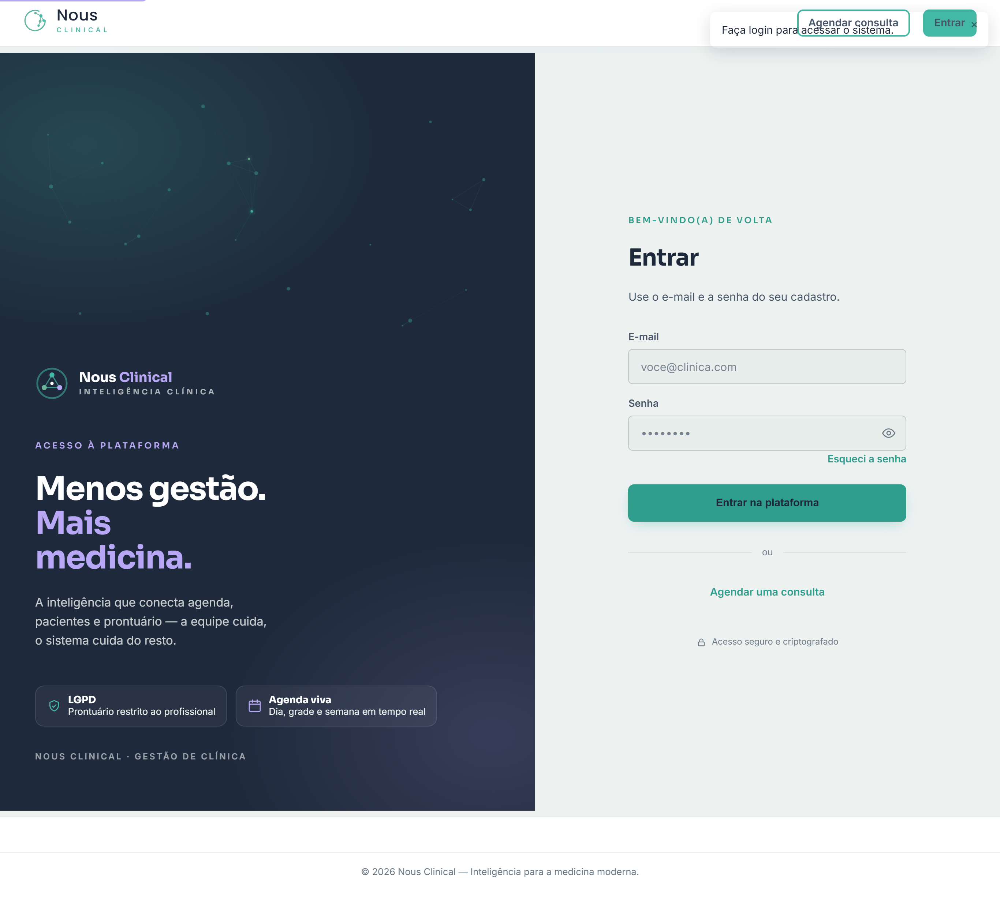

# Administração da Plataforma (uso interno PGS)

> ⚠️ **Este capítulo NÃO é para a clínica cliente.** Ele descreve o painel de
> **superadmin** — o nível da plataforma, usado **internamente pela PGS** (os donos
> do Nous) para gerenciar as clínicas. Não inclua esta seção no manual entregue ao
> cliente.

## O que é o superadmin

O **superadmin** está **acima de qualquer clínica**. Diferente do administrador (que
manda na *sua* clínica), o superadmin enxerga **todas** as clínicas da plataforma e
serve para **cadastrar e administrar os clientes**.

- É o login **dos sócios** (ex.: Mateus e Lucas).
- Não pertence a nenhuma clínica — por isso vê os totais consolidados de todas.
- **Pouquíssimas contas**, com senha forte. Não é conta para a equipe das clínicas.

> 🔒 **Quem acessa:** apenas superadmin. Nenhum usuário de clínica (admin, recepção,
> profissional) vê esta área.

## Tela de Clínicas

Em **Clínicas**, o superadmin vê a lista de todas as clínicas, com contagens
(usuários, pacientes) e os totais gerais da plataforma.

O que dá para fazer aqui:

1. **Nova clínica** — cria a clínica **e** o primeiro login de administrador dela
   (nome, e-mail e senha do admin). É assim que um cliente novo entra na plataforma.
2. **Ativar / desativar** uma clínica — desativar bloqueia o acesso da clínica sem
   apagar nada (útil para inadimplência ou pausa de contrato).

## Boas práticas (produção)

- **Não existe** autocadastro de superadmin. Em produção, a primeira conta de
  superadmin é criada de forma deliberada no deploy (script/CLI), com e-mail real e
  senha forte dos sócios — nunca via seed de demonstração.
- O seed de desenvolvimento (`scripts/seed.py`) e a conta `super@nous.com` usada para
  gerar as imagens deste manual existem **apenas no ambiente local** e **não vão para
  produção**.
- Mantenha o número de superadmins no mínimo (os sócios). Cada acesso fica registrado
  na auditoria.

> 💡 **Para o cliente:** o que a clínica precisa saber é que **ela** tem o papel de
> *administrador* para gerir o próprio negócio. A camada de plataforma é
> transparente para ela.
